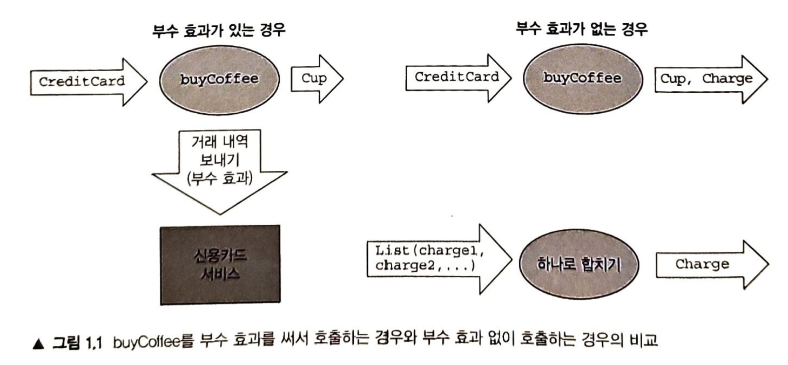
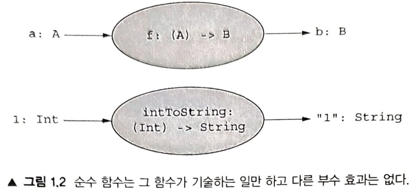
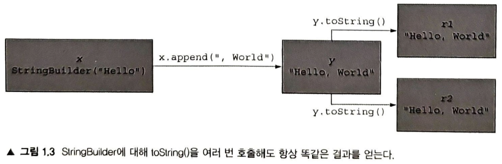
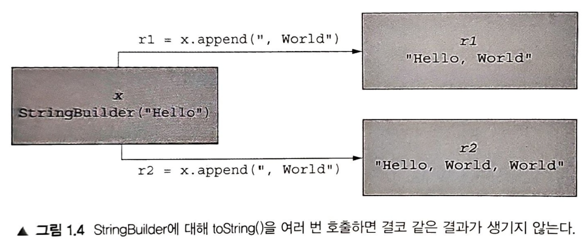

- [1장. 함수형 프로그래밍이란?]
  - [1.1 FP의 장점 : 간단한 예제](#11-fp의-장점--간단한-예제)
  * [1.1.1 부수효과가 있는 프로그램](##111-부수효과가-있는-프로그램)
  - [1.1.2 함수형 해법 : 부수 효과 제거하기](#112-함수형-해법--부수-효과-제거하기)
  + [[구조 분해1 통해 값 추출하기]](#구조-분해1-통해-값-추출하기)
  + [[실제 세계에서는 어떻게 해야 할까?]](#실제-세계에서는-어떻게-해야-할까)
  - [1.2 정확히 (순수) 함수란 무엇인가?](#12-정확히-순수-함수란-무엇인가)

# 1장. 함수형 프로그래밍이란?

---

* 순수함수 : 아무런 부수효과[side effect]가 없는 함수
  - 부수효과 : 결과로 반환하는 것 외 진행되는 처리
* 명령형 스타일 [imperative style]
  - 명령 단계마다 시스템의 상태를 바꾸는 처리 스타일
    - 접근은 단순하지만, 복잡도가 누적되어 버그를 관리하게에 유용하지 않다.
* 함수형 프로그래밍 [FP. Functional Programming]

* 부수효과 예시 
  1. 변경이 일어나는 블록 외부 영역에 있는 변수를 변경
  2. 데이터 구조를 인플레이스[in-place]로 변경 (메모리 내용 직접 변경)
  3. 객체의 필드 설정
  4. 예외를 던지거나 예외를 발생시키면서 프로그램 중단
  5. 콘솔에 출력하거나 사용자 입력 처리
  6. 파일 IO
  7. 화면 그리기

* FP 효과
  1. 프로그램을 어떻게[how] 만들것인가 (not what)
  2. 부수효과 없이도 IO 수행, 오류처리, 데이터 변경 등 프로그램의 핵심을 기술하는 방법 review
  3. FP로 순수함수 사용 시 모듈성 향상에 따른 효과 : 테스트, 재사용, 병렬화, 일반화, 결과추론, 버그관리에 용이
  4. 참조투명성, 치환모델 필수개념 정의 

---

참고사항
* 코틀린을 이용한 예제 구성
  - 코틀린 언어 자체보다 함수형 프로그래밍에 사용된 개념을 구축하는 방향
  - 코틀린에 존재하지 않는 서드파티 라이브러리에 의존하는 요소가 있다.(애로우 http://arrow-kt.io)
  - 정적타입언어[statically typed language]의 타입시스템에 주로 의존 : 타입 지정 함수형 프로그래밍[typed functional programming]
  - 카테고리 이론[category theroy] : 타입에 의한 함수형프로그래밍 스타일과 관련된 이론
  - 대수[algebra], 증명[proof], 법칙[law] .. 

---

## 1.1 FP의 장점 : 간단한 예제
### 1.1.1 부수효과가 있는 프로그램
- 커피판매 프로그램의 구현부에서 부수효과를 사용하는 코틀린 프로그램 확인
- 부수효과 영향 : 어려운 테스트(신용카드까지 테스트의도 X)
<p align="right">
[kotlin] <a href="https://kotlinlang.org/docs/basic-syntax.html#functions"> [function] </a>
</p>

```kotlin
/*리스트 1.1 부수효과가 있는 코틀린 프로그램*/
class Cafe {
    fun byCoffee(cc: CreditCard): Coffe{
        val cup = Coffe() // 새로운 커피를 한 잔 초기화
        cc.charge(cup.price) // 커피 가격을 신용카드로 청구 - 부수효과
        return cup //커피 반환
    }
} 
 ```
  * fun 함수명(파라미터변수 : 파라미터객체):응답객체{return 응답인스턴스}
- 개선방향 : 설계 개선
  - CreditCard는 신용카드사에 접속해서 비용청구 방법을 몰라야 함
  - 내부 시스템에서 청구기록 영속화 절차도 몰라야 함
```kotlin
/*리스트 1.2 Payments 객체 추가*/
class Cafe{
    fun buyCoffee(cc: CreditCard, p:Payment): Coffe{
        val cup = Coffe()
        p.change(cc, cup.price)
        return cup
    }
}
```
- 효과 : 테스트성 개선 - Payment를 인터페이스로 선언 > mock 활용
- 고찰
  - Payment 인터페이스가 굳이... mock 굳이...
  - buyCoffee 호출 후 확인을 위한 내부상태 관리, charge 호출 후 변경여부 검사.
  - buyCoffee가 커피한잔에 해당하는 비용을 제대로 청구했는지 테스트하는데 번거롭다.
- 다른고찰
  - buyCoffee 재사용 부적합
    - 커피 12잔 주문시 buyCoffee 12회 호출에 따른 신용카드사 12회 호출 : 수수료폭탄
      - 그렇다고 12잔 처리로직을 하나 더? 
      - 코드 재사용성과 합성성 저하
        
### 1.1.2 함수형 해법 : 부수 효과 제거하기
- 부수효과 제거 : buyCoffee가 Coffee와 함께 청구금액도 반환 > 관심사 분리
  - 신용카드 청구금액 전달, 거래내역 영속화 관심사 분리를 위한 재구성
  
- 코틀린 함수형 해법
  - 관심사 분리 : 금액청구, 청구처리 및 해석
  - buyCoffee : Coffee, Charge 함께 반환
<p align="right">
[kotlin] <a href="https://kotlinlang.org/api/latest/jvm/stdlib/kotlin/-pair/"> [Pair] </a>
</p>

```kotlin
/*리스트 1.3 더 함수적인 커퓨구입 접근방법*/
class Cafe{
    fun buyCoffee(cc: CreditCard): Pair<Coffee, Charge>{
        val cup = Coffee()
        return Pair(cup, Charge(cc, cup.price))
    }
}
```
- Charge : CreditCard, amount 포함 - 같은 CreditCard에 대한 청구를 하나로 처리하는 함수(combine) 제공
  - 관리대상 정보 : CreditCard, Float 
  - Charge 인스턴스간 병합을 처리하는 편리메서드[handy method] : combine
    - 신용카드가 다른 요금 객체의 병합인 경우 예외발생
```kotlin
/*리스트 1.4 데이터 타입인 Charge*/ 
data class Charge(val cc: CreditCard, val amount: Float){ /*생성자와 불변 필드가 있는 데이터 클래스 선언*/
    fun combine(other: Charge): Charge = /*같은 신용카드에 대한 청구를 하나로 묶음*/ 
            if(cc == other.cc) /*같은 카드인지 검사. 같은카드 아니면 예외 발생*/
                Charge(cc, amount + other_amount) /*해당 Charge와 다른 Charge 금액을 더한 새로운 Charge 반환*/
            else throw Exception(
                    "Cannot combine charges to different cards"
            )
}
```
- n잔 구입 시 buyCoffee 로 combine 적용 가능
  - unzip : 쌍[pair]의 리스트를 별도 두 리스트로 분해[destructure]
    - 분해대상 리스트 : [List<Pair<Coffee, Charge>>] Pair의 순차적 두 인자의 리스트
    - 분해 : 어떤 복잡한 데이터타입에서 값을 분리해 내는 처리과정
      - 결과 : list<Coffee> > coffees | List<Charge> > charges
<p align="right">
[kotlin] <a href="https://kotlinlang.org/api/latest/jvm/stdlib/kotlin.collections/unzip.html"> [unzip] </a>
</p>

```kotlin
/*리스트 1.5 buyCoffee로 커피 여러잔 구입하기*/
class Cafe {
    fun buyCoffee(cc: CreditCard): Paire<Coffee, Charge> = TODO()
    fun buyCoffees(
            cc: CreditCard,
            n : Int //구매할 커피잔 수
    ): Pair<List<Coffee>,Charge>{ // (반환객체정의)
        
        val purchases : List<Pair<Coffee, Charge>> = 
                List<n> { buyCoffee(cc)} // 자체적으로 초기화되는 리스트를 생성 (n : 커피잔수)
        
        val (coffees, charges) = purchases.unzip() // Pair의 리스트를 두 리스트로 분리
        
        return Pair( // (반환객체에 맞춰 charge를 하나로 통합하기 위해 reduce로 줄임 : combine 사용)
                coffees,
                charges.reduce{c1, c2 -> c1.combine(c2)}
        ) // coffees를 하나의 Charge로 합친 출력을 생성
    }
}
```
* (어색한 문법)
  * val purchases : List<Pair<Coffee, Charge>> = List<n> { buyCoffee(cc)}
  * 파라미터로 전달받은 n개만큼 리스트를 만드는데, cc를 이용한 buyCoffee 결과니까 Paire<Coffee, Charge> 를 응답한 객체라는건데...
익숙해질수 있을까..

---

###### [구조 분해1 통해 값 추출하기]
* 코틀린은 객체의 구조 분해를 허용
  * 구조 분해를 분해(decomposition)나 추출(extraction)이라고도 한다
* 대입식의 값들(등호의 좌변)이 식(등호의 우변)으로부터 추출될 때 분해가 일어남. 
* Pair를 left와 right 원소로 분해하고 싶은 경우
  * 순서쌍에 들어 있는 값이 들어갈 변수 이름을 콤마로 분리해 나열하고
  * 괄호. 즉 (와)로 둘러싸면 된다.
```text
val (left, right) = Pair(l, 2)
assert left == 1
assert right == 2
```
* 구조 분해 다음에 오는 코드에서는 분해한 값을 일반적인 코틀린 값과 마찬가지로 사용 가능.
* 불필요한 값은 밑줄인 _를 써서 무시 가능.
```kotlin
val (_, right) = Pair(l, 2)
```
* Pair 타입과 함꼐, List 등 다양한 클래스에서 구조 분해가 가능.
* 코틀린 [구조분해](https://kotlinlang.org/docs/destructuring-declarations.html)
  * 실제 클래스가 값을 반환하는 함수 operator fun componentN()을 오버라이딩시
    * 인스턴스 구조 분해 가능
  * 데이터 클래스 : (컴파일러가 자동으로) 생성자에 필드가 선언된 순서대로 componentN을 만들어줌
    * 리스트의 경우 component5()까지 정의됨. 
    * 테스트 : 사용자가 정의하는 경우 시에 제한은 없는 것 같음
      * 중간에 숫자를 빼먹어도 컴파일 시 오류가 발생하거나 경고해주지 않으므로 주의 필요.

---

* 결과 : 
  * buyCoffee 함수를 재사용 가능, Payment 인터페이스에 복잡한 목 구현 불필요 - 두 함수 테스트 용이
  * Cafe는 Charge값의 처리방식과 독립됨 (실제금액 청구시 Payment 클래스는 사용 - 몰라도 됨)
  * Charge를 일급시민[first-class value]으로 구성시 장점
    * 분할 주문시에도 하나로 묶어서 청구 : 수수료 절감
    * 일급시민 Charge의 효과를 이용하여 같은 카드 청구금액 병합

```kotlin
/*리스트 1.6 청구 금액 합치키*/
fun List<Charge>.coalesce(): List<Charge> =  // (coalesce 함수를 List<Charge>에 추가)
        this.groupBy{it.cc}.values.map{it.reduce{a,b -> a.combine(b)}}
```

* 확인 : 확장메서드를 이용해 행동을 클래스에 추가하는 방법 (확장메서드 : 청구금액 합치기)
* 함수에 값으로 다른 함수를 전달 : groupBy, map, reduce
* 익명함수[anonymous function] : 청구 금액을 하나로 합쳐서 카드마다 하나씩 （합쳐진） 청구를 만들어낸다.
  * 완전 재사용 가능, 목 객체나 인터페이스 사용 없이도 테스트 용이
    * {it.cc}
    * {a,b -> a.combine(b)}
* FP는 스타일은 상당히 어렵지민-, 아주 아름답고 응집력이 높은 프로그  래밍 방법

---

###### [실제 세계에서는 어떻게 해야 할까?]
* buyCoffee의 경우 Charge의 생성과 Charge의 처리나 해석을 분리 가능
* 부수 효과가 있는 모든 함수에 대해 이런 종류의 변환을 적용해서 
  * 부수 효과를 프로그램의 바깥 계층으로 빼내는 방법을 배울 것
  * 함수형 프로그래머들은 함수형 핵심의 밖을 
    * 부수 효과를 처리하는 얇은 계층으로 둘러싸는 방식으로 프로그램을 구현하는 것에 대해 종종 이야기한다.
    * 어느 시점에는 외부 세계에 대한 부수 효과를 실제로 사용.
    * 외부 시스템이 Charge를 처리하도록 제출 필요
    * 부수 효과나 상태 변이가 꼭 필요한 다른 프로그램은 어떻게 할까?, 이런 프로그램을 어떻게 작성할 수 있을까? 
      * 불가피한 부수 효과처럼 보이는 프로그램들 중 상당수에 대해 비슷한 함수형 해법이 있음 확인. 
      * 그 외, 효과가 발생하지만 관찰 가능（observable）하지 않도록 코드의 구조 개선방법 확인. 
      * 받아들일 수 있는 시나리오
        * 함수 본문에 지역적으로 선언된 데이터가 그 함수 외부에서 참조되지 않는 한,
          * 그 데이터를 변화시킬 수 있다.
        * 외부 함수에서 파일에 데이터를 썼다는 사실을 발견하지 못하는 한,
          * 내부 함수에서 파일에 데이터를 기록할 수 있다.


---

## 1.2 정확히 (순수) 함수란 무엇인가?

* FP : 순수함수를 이용한 프로그래밍
* 순수함수 : 부수효과 없는 함수
* 부수효과와 순수성에 대해 비형식적인 개념으로 커피쇼예제 개선... 비형식적 개념?
  * 반환하는 응답객체 외 다른 작업을 의미하는 부수효과 개선방법에서 비형식적 개념 언금 (추후 형식적인 정의 예정)
  * **비형식적인 개념의 접근을 형식화해 보자** 
    * 목적 : 순수함수에 대해 더 추론하기 용이함
* 함수 (입력타입A, 출력타입B 로 구성된 함수 f) : (A) -> B, A to B
  * A타입의 모든 값 a를 B타입의 값 중 하나인 b와 관계를 형상하는 계산 : **b는 a에 의해서만 결정된다.**
  * f(a) 계산 시, 외부나 내부 처리상태의 변경에 영향을 주지 않음.
  * 사례
    * intToString : (int) -> String (정수를 문자열로 치환하는일 외 다른 일은 일어나지 않음)
    

* 순수함수 : 함수가 주어진 입력으로부터 결과를 계산하는 것 외 다른 어떤 관찰 가능한 효과가 없음(부수효과 없음)
  * 부수효과를 처리하는 코드 덩어리 : 프로시저[procedure]
  * 참조투명성[Referential Transparency] 개념으로 형식화 (식의 일반적인 특성)
* 식
  * 코틀린 인터프리터에 타이핑하여 결과를 얻는 모든것
  * 2 + 3 : 순수함수(plus 를 2,3에 적용하는 식 - 2,3 역시 식) - 부수효과 없음
    * 언제나 결과는 5 : 프로그램은 2+5 를 5로 치환 가능
    * 어떤 식이 참조 투명하다
  * 참조 투명한 인자를 이용해 호출한 결과가 참조투명한 함수가 있다면, 함수도 참조투명하다.

---

#### [참조 투명성과 순수성]
* 어떤 식 e가 모든 프로그램 p에 대해
  * p안의 e를 평가한 결과로 치환해도 p의 의미에 영향이 없으면 : e가 참조투명하다.
  * 모든 참조투명한 x에 대해 어떤 함수 f에 있어서 식 f(x)가 참조 투명하다면 : 함수 f도 참조 투명하다.

---

## 1.3 참조 투명성, 순수성, 치환 모델

* 참조투명성 정의 : 함수가 수행하는 모든 일이 함수의 반환값에 의해 표현돼야 한다. (제약)
* buyCoffee 예제에 참조투명성 정의 적용
  * cc.charge(cup.price) : buyCoffee 반환값에 영향을 주지 않음 
  * buyCoffee() 순수함수 요건
    *  p가 무엇이든 관계없이 p(buyCoffee(aliceCreditCard))가 p(Coffee())와 동일 (alice : 여자이름)
    *  아래 예시는 성립하지 않음 : 신용카드사를 통해 커피값을 청구함
```kotlin
fun buyCoffee(cc: CreditCard): Coffee{
    val cup = Coffee() // (반환값 cup)
    cc.charge(cup.price) // (호출반환값 무시됨)
    return cup
}
```
* 프로그램 평가에 대한 추론 : 참조투명성 제약을 통한 치환모델[substitution model]
  * 식이 참조 투명하면 계산과정이 대수 방정식을 풀 때와 마찬가지로 진행된다. 고 생각할수있다?
* 참조투명성 : 프로그램에 대해 등치 관계를 사용한 추론을 가능하게 한다.

---

* 코틀린 인터프리터 테스트 : 읽기[Read]-평가[Eval]-출력[Print]-루프[Loop] - REPL (레플)

#### 두가지 예 : 문자열(불변) 문자열을 변경한 문자열은 실제로 새로운 문자열, 기준 문자열은 원래대로 남음

##### A. 모든 식이 참조투명하기 때문에 치환 모델로 추론 가능
* 참조투명한 문자열처리 
  ```text
  >>> val x = "Hello, World"
  res1 : kotlin.String = Hello, World
  
  >>> val r1 = x.reversed()
  res2 : kotlin.String = dlrow ,olleH
  
  >>> val r2 = x.reversed()
  res3 : kotlin.String = dlrow ,olleH 
  
  // (r1, r2 가 같은 값으로 평가됨)
  ```
* x 가 등장하는 부분을 x가 가리키는 식으로 바꾸면 : 변수를 식으로 치환해도 프로그램 결과는 동일
  ```text
  >>> val r1 = "Hello, World".reversed()
  res4 : kotlin.String = dlrow ,olleH
  
  >>> val r2 = "Hello, World".reversed()
  res5 : kotlin.String = dlrow ,olleH
  
  // (r1, r2 가 같은 값으로 평가됨)
  ```
* 식 변경에도 출력값 동일 : x는 참조 투명성 확인 
* r1, r2 앞선 결과와 동일 : r1, r2는 참조 투명성 확인

#### B. 참조 투명성을 위배하는 식 사용
* 객체 내부를 변화시키는 java.lang.StringBuilder 로 호출될때마다 이전상태를 수정하여 결과가 파괴됨
  ```text
  >>> val x = StringBuilder("Hello")
  res6 : kotlin.text.StringBuilder /* = java.lang.StringBuilder */ = Hello
  
  >>> val y = x.append(", World")
  res7 : java.lang.StringBuilder! = Hello, World
  
  >>> val r1 = y.toString()
  res8 : kotlin.String = Hello, World
  
  >>> val r2 = y.toString()
  res9 : kotlin.String = Hello, World
  ```
  
* 부수효과의 참조 무결성 파괴
  * 변수를 정의로 치환하여 실행 : y > append 호출
  ```text
  >>> val x = StringBuilder("Hello")
  res6 : kotlin.text.StringBuilder /* = java.lang.StringBuilder */ = Hello
  
  >>> val r1 = x.append(", World").toString()
  res8 : kotlin.String = Hello, World
  
  >>> val r2 = x.append(", World").toString()
  res9 : kotlin.String = Hello, World, World
  ```
  
  * 식의 치환이 다른 결과 발생 : StringBuilder.append는 순수함수가 아님
  * r1, r2 의 외형은 같은 식으로 보이지만, StringBuilder 객체의 다른 두 값(상태)를 지시함.
    * r1 = append 처음 호출한 x가 가리키는 객체 변경
    * r2 = 두번째 append를 호출한 변경된 x가 가리키는 객체 처리
    * 부수효과를 동반하면 프로그램의 동작 추론에 어려움.
  * 치환 모델은 평가의 효과가 지역에 한정되어 추론에 용이함 : 지역추론[local reasoning]


* 순수성 개념 형식화 : 함수정의를 참고하여 함수 파라미터를 대응하는 함수인자에 치환 - 치환 모델
* 모듈적인 프로그램 : 재사용 가능한 요소로 구성 - 전체 프로그램의 의미가 구성요소와 의미를 합성하는 법칙만 의존
  * 합성 가능[composable]
* 순수함수 = 모듈적 = 함성적 = 블랙박스 : 질문(입력방법, 결과처리방법)과 계산로직 분리
  * 순수함수 입력 : 인자 전달로만 공급
  * 순수함수 출력 : 계산된 결과의 반환으로만 응답
* buyCoffee 예제 
* 부수효과 : 출력 시 수행하는 지불 - 제거 
  * 함수로직 테스트, 합성(buyCoffees, coalesce)

---

## 1.4 앞으로 살펴볼 내용

* 도서 정책 : 
  * 함수형 프로그램의 제일원리[first principle]
  * 초점 : 범용 언어를 통해 객체지향과 명령형 프로그래잉 이해
* 학습기법
  *  ■ 함수형 스타일로 코드를 작성하는 방법
  * ■ 여러 데이터 구조를 다루는 방법
  * ■ 오류를 함수적으로 처리하는 방법
  * ■ 지 연 계산을 사용하는 방법과 순수 함수적 인 싱태를 처 리하는 방법
  * ■ 병렬성, 속성 기반 테스트, 파서 콤비네이터 라이브러리에 함수형 설계를 적용하는 방법
  * ■ 모노이드, 모나드, 적용 가능 펑터와 순회 가능 펑터를 이해하고 사용함
  * ■ 외부 효과, 지역 효과, 상태 변이, 스트림 처리, 증분형 IO 등의 고급 기능을 자신 있게 다루는 방법

---

## 요약
#### ■ 함수형 프로그래밍은 코드 모뉼성을 높여준다.
#### ■ 순수 힘수로 인해 얻어지는 모듈성은 테스트 기능성, 코드 재사용, 병렬성, 일반화 가능성 등을 더 힝싱시켜준다.
#### ■ 모듈적인 함수형 코드에 대해 추론하기가 더 쉽다.
#### ■ 함수형 프로그래 밍은 온전히 순수 함수만 시용하는 방향으로 우리를 이끌어준다.
#### ■ 순수 힘수는 부수 효과가 없는 힌-수라고 정의할 수 있다.
#### ■ 부수 효과가 있는 함수는 결괴를 빈횐히는 일 외에 다른 일을 하는 함수다.
#### ■ 함수가 히는 일이 그 힘수의 반환값만으로 표현될 수 있을 때 이런 함수를 ‘참조 투 명하다’라고 말힌다.
#### ■ 치환 모델을 시용하면 함수의 참조 투명성을 증명할 수 있다