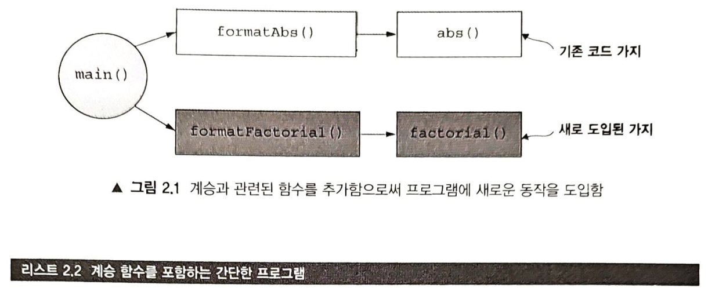
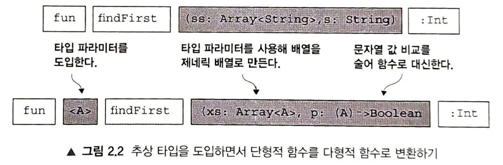

### [목차]
* [2.1 고차 함수: 함수를 함수에 넘기기](#21-고차-함수-함수를-함수에-넘기기)
  * [2.1.1 잠시 돌아가기: 루프를 함수적으로 작성하는 방법](#211-잠시-돌아가기-루프를-함수적으로-작성하는-방법)
    * [[코틀린의 꼬리 호출]](#코틀린의-꼬리-호출)
    * [(연습문제 2.1)](#연습문제-21)
  * [2.1.2 첫 번째 고차 함수 작성하기](#212-첫-번째-고차-함수-작성하기)
    * [변수 명명 관습](#변수-명명-관습)
    * [함수를 값으로 다루기](#함수를-값으로-다루기)
* [2.2 다형적 함수: 타입에 대해 추상화하기](#22-다형적-함수-타입에-대해-추상화하기)
  * [2.2.1 다형적함수 예제](#221-다형적-함수-예제)
    * [(연습문제 2.2)](#연습문제-22)
    * [확장 메서드와 프로퍼티](#확장-메서드와-프로퍼티)
  * [2.2.2 익명 함수를 사용해 고차 함수 호출하기](#222-익명-함수를-사용해-고차-함수-호출하기)
* [2.3 타입에 맞춰 구현하기](#23-타입에-맞춰-구현하기)
  * [(연습문제 2.3)](#연습문제-23)
  * [(연습문제 2.4)](#연습문제-24)
  * [(연습문제 2.5)](#연습문제-25)
* [요약](#요약)

[&emsp;> [to README]](../README.md)

---

# 2장. 코틀린으로 함수형 프로그래밍 시작하기

* 순수함수만 사용하자.
  * ASIS : 순차작으로 실행되는 부수효과를 야기하는 명령어들로 프로그램 작성에 익숙
  * TOBE : 순수함수 조합으로 프로그램 작성
* 목표 :
  * 꼬리재귀함수를 사용해 루프작성
  * 고차함수[HOF, High Order Funcion] 설명 : 다른함수를 인자로 받고 출력으로 함수를 반환할 수 있는 함수
  * 다형적 고차함수예제 확인 : 타입이 다형적 고차함수 구현방법 설명
  * 고차함수는 가볍게 : 이후 다른각도록 설명

[[to TOP]](#목차)

---

## 2.1 고차 함수: 함수를 함수에 넘기기
* 함수형 프로그램 작성 기본주제
  * 함수도 값 : 다른 타입（정수, 문자열, 리스트 등）의 값과 마찬가지로
    * 함수를 변수에 대입
    * 데이터 구조에 저장
    * 함수의 인자로 전달
  * 순수 함수형 프로그램을 작성 : 종종 다른 함수를 인자로 받는 함수를 작성(고차 함수) - 유용 
  * 고차 함수 개념 예제
    * (이번 장의 뒷부분) 고차 함수의 유용성
    * 함수형 프로그래밍 스타일 곳곳에 적용정 
  * 첫 번째 예제
    * 어떤 수의 절댓값과 다른 수의 계승（팩토리얼fact어31）을 출력하는 프로그램
    * 다음은 이 프로그램을 실행한 결과
    ```
    The absolute value of -42 is 42 
    The factorial of 7 is 5040
    ```
[역주] 전통적인 명령형 언어
* C++
  * operatorO를 오버로딩하면 호출 가능한 객체 생성가능
  * 템플릿 프로그래밍을 통해 상당한 수준의 제네릭 타입 추상화가 가능
  * 람다 도입 : c++는 이미 충분히 함수형 프로그래밍이 가능한 언어
* C
  * 함수 포인터가 비슷한 역이 가능하다 추정
  * 클로저 기능 지원하지 않음 
    * 함수포인터는 함수를 함수에 파라미터로 전달하는 수단
    * but, 책에서 설명하는 함수형 프로그래밍에 필요한 완전한 기능 제공 불가

* 절대값 출력 코드
  ```kotlin
  object Example{
    
    private fun abs(n:Int):Int = 
        if(n<0) -n 
        else n
  
    fun formatAbs(x:Int):String{
      val msg = "The absolute value of %d is %d"
      return msg.format(x, abs(x))
    }
  }
  fun main(){
      println(Example.formatAbs(-42))
  }
  ```
  * 계승 계산 : 인덱스 변수를 변이시키면서 루프 사용 필요
    * 순수함수 : 변이 사용 불가
    * 함수로 루프 작성방법 확인

[[to TOP]](#목차)

---

### 2.1.1 잠시 돌아가기: 루프를 함수적으로 작성하는 방법
* 고차 함수 활용을 위한 기존 프로그램 개선을 위해 새로운 동작 도입 필요
  * n의 계승을 계산하는 새 함수 추가
  * 루프를 순수 함수로 작성하는 방법
  * 재귀 recursive로 순수 함수 루프 작성
```kotlin
/*리스트 2.1 factorial 함수*/
fun factorial(i:int): Int{
    fun go(n: Int, acc:Int): Int = // 내부 또는 지역함수 정의
        if(n<=0) acc
        else go(n-1, n*acc)
    return go(i,1) // 정의한 지역함수 호출
}
```
[노트] 본문에서만 사용 가능한 작여함수 작성 필요
* 지역정수, 지역문자열 변수 정의 대신 지업함수 정의 적응필요

* 변수를 변이시키지 않고 루프를 함수적으로 작성하기 위해 재귀 함수 사용
  * 리스트 2.1 에서는 factorial 함수 본문 안에 재귀적인 도우미 함수 작성
  * 도우미 함수 : 
    * 전형적인 경우, 바깥쪽 함수와 다른 시그니처로 누적값 파라미터 등을 포함하면서 재귀호출 처리
    * 관례적으로 이런 도우미 함수의 이름을 go나 loop로 정의
  * 코틀린에서는 다른 함수 정의의 내부에 있는 블록을 포함하는 모든 블록 안에서 함수 정의 가능
  * go 함수는 지역 함수 : 지역 변수와 마찬가지로 factorial 함수의 본문 영역에서만 참조 가능
  * factorial 정의 코드 : 루프의 초기 조건 지정 > 함수 호출
* go의 인자가 루프의 상태 : n, acc
  * 루프의 상태 구성
    * 더 처리해야 할 값 : n
    * 지금 까지 누적된 계승 값 : acc
  * 루프의 다음 이터레이션[iteration]을 진행하려면 
    * 새 루프 상태 지정 
    * go 함수를 재귀 호출
    * `go（n-l, n*acc）`
  * 루프를 종료시 키려면 재귀 호출을 하지 않고 값을 반환
    * `n <= 0`일 때 `acc` 반환
* （루프로 표현할 수 있는）식의 재귀를 수동으로 감지하지는 않음
  * 함수 앞에 `tailrec` 변경자 붙이도록 요구
  * tailrec이 붙은 경우 컴파일러는 재귀 호줄이 꼬리 위치[tail position]인 경우에 한해 
    * whiie 루프로 작성했을 때와 같은 종류의 바이트 코드를 도출함. 
    * 코틀린에서는 while 루프를 나쁜 것으로 간주. 
      * 합성에 사용 하기 쉬운 스타일이 아님, 꼭 필요한 경우도 적다.  
    * 기본적인 아이디어는 재귀 호출에서 반환된 다음에 수행해야 하는 추가 작업이 없는 경우
      * 최적화(꼬리 호출 제거[tail call elimination]） 적용 가능

[노트] 최적화? 
```
('비본질적인 성능 향상'의 의미보다)
* 루프를 작성하기 위해 꼬리 호출을 사용하는 것의 의미는
  * 보통 꼬리 호출이 이터레이션 될 때마다 
    * '스택 프레임을 소비하지 않는 반복적인 루프로 컴파일 된다는 사실'에 의존하려는 의도
* 이터레이션 마다 스택 프레임을 소비하면 큰 입력시 StackOverflowError 발생
```
[[to TOP]](#목차)

---

###### [코틀린의 꼬리 호출]
* 재귀적인 함수 호출을 하는 호출자
  * 재귀 함수 호출이 반환값을 즉시 호출하기만 하고 다른 아무 일도 하지 않을 때 
  * '이 재귀 호출이 꼬리 위치에 있다'고 말한다. 
  * 예를 들어 앞에서 본 `go(n-l, n*acc)`라 는 재귀 호출에서는 
    * 호출 결과를 직접 반환하고, 호출 결과에 대해 다른 어떤 일도 하지 않으므로 : 꼬리 위치에 있다. 
    * 반면에 `1 + go(n-l, n*acc)`라는 식이 있다면 : go 호출이 더 이상 꼬리 호출 위치에 있지 않게 된다. 
      * 재귀적으로 go 함수를 호출한 결과에 대해 추가로 해야 할 일(1을 더하는 계산)
* 어떤 함수의 모든 재귀 호출이 꼬리 위치에 있고 함수 앞에 tailrec 변경자가 붙어 있으면 
  * 코틀린 컴파일러는 재귀를 이터레이션 시 호출 스택을 소비하지 않는 반복적인 루프로 컴파일 : (컴파일 효과에 의한 개선을 고려해 위에서는 최적화 표현의 적절성을 언급했다.)
```kotlin
fun factorial(i: Int): Int {
  tailrec fun go(n: Int, acc: Int): Int = // tailrec 변경자는 꼬리 호출을 제거하라고 컴파일러에 명령
      if (n <= 0) acc
      else go(n - 1, n * acc) // 이 함수의 마지막 재귀 호출이 꼬리 위치에 있다.
  return go(i, 1)
}
```
* `tailrec` 표시가 없으면 (재귀 함수의 모든 재귀 호출이 꼬리 위치에 있더라도) 
  * 컴파 일러가 꼬리 호출을 최적화하지 않음 > StackOverflowError 발생가능. 
  * 재귀 호출이 꼬리 위치가 아닌 재귀 함수의 앞에 tailrec을 붙이면 : 컴파일러 경고
  ```text
  Warning:(19, 9) Kotlin: A function is marked as tail-recursive 
  but no tail calls are found
  ```
* 경고보다 컴파일 오류가 더 유용하고 안전했걸...

[[to TOP]](#목차)

---

###### (연습문제 2.1)
* n번째 피보나치 수[[Fibonacci number](https://www.britannica.com/science/Fibonacci-number)]를 얻기 위한 재귀 함수를 직싱히라. 
* 처음 두 피보나치 수는 0과 1. 
* n번째 피보나치 수는 자신 바로 앞의 두 피보나치 수의 합. 
* 피보나치 수열은 0, 1, 1, 2, 3, 5, 8, 13, 21 등.
* 함수 정의 : 지역적인 꼬리 재귀 함수를 사용
```kotlin
fun fib(i: Int): Int = S0LUTI0N_HERE() // TODO() 함수의 별명

fun fib(i: Int): Int {
  tailrec fun go(n: Int, f: Int, s: Int): Int =
    if (n > 0) go(n-1, s, f+s)
    else s
  return go(i, 0, 1)
}

```
[노트] S0LUTI0N_HERE() - 향후 작성할 코드 부분 표시(코틀린 내장함수)
* TODO() 함수의 별명
* 용도 : 주의 환기용 메모에 도움
* 미구현하여 방치된 상태로 컴파일, 빌드는 되지만, 프로그램 평가 시 'NotlmplementedError'에러 발생
  ```
  Kotlin: Unresolved reference: S0LUTI0N_HERE
  ```

[[to TOP]](#목차)

---

###  2.1.2 첫 번째 고차 함수 작성하기
* 구체적인 목적 구현 코드 > 다양한 시나리오에 적용할 수 있는 코드 작성
* 새로운 요구사항 정의 > 고차 함수로 이뤄진 함수형 해법에 도달할 때까지 
  * 점진적 설계 개선 - 반복적인 접근 방법 학습
* n번째 계승을 계산하는 factorial 함수
* 절댓값 출력을 표시하는 코드(2.1절)에 계승 함수 도입
* (abs와 formatAbs의 관계 참고) formatFactorial 추가. 
* 그림 2.1은 기존 코드가 main에서 formatAbs를 호출 했던 것처럼 
  * 새로 추가한 formatFactorial 호출 표시

```kotlin
/*리스트 2.2 계승 함수를 포함하는 간단한 프로그램*/
object Example{
    private fun abs(n:Int):Int = 
        if(n<0) -n
        else n
  
    private fun factorial(i:Int):Int { //계승함수를 추가하면서 private으로 마크함
        fun go(n:Int, acc:Int):Int = 
            if(n<=0) acc
            else go(n-1, n*acc)
        return go(i,1)
    }
    
    fun formatAbs(x:int):String{
        val msg = "The absolute value of %d is %d"
        return msg.format(x, abs(x))
    }
  
    fun formatFactorial(x:Int):String{
        val msg = "The factorial of %d is %d"
      return msg.format(x, factorial(x))
    }
    
    fun main(){
        println(Example.formatAbs(-42))
        println(Example.formatFactorial(7)) // main 메서드에서 formatFactorial 호출
    }
}

```
* 개선방향 : 유사한 기능과 구조에 두 함수를 일반화하여 formatResult 병합처리
  * 인자로 받은 값에 적용할 함수를 파라미터로 전달
```kotlin
fun formatResult(name: String, n:Int, f:(Int)->Int): String{
    val msg = "The %s of %d is %d."
    return msg.format(name, n, f(n)) 
}
```
* formatResult 함수 : 고차 함수 - f라는 이름의 다른 함수를 파라미터로 받음
* 다른 파라미터와 마찬가지로 f에 대해서도 타입 지정
  * 타입: `(Int) -> Int`로, f가 정수를 인자로 받고 정수를 반환하는 함수
  * [->] 읽기 : '화살표', '투[to]'

[[to TOP]](#목차)

---

###### [변수 명명 관습]
* 고차 함수(특히 함수)의 파라미터 : f, g, h 같은 (짧은)이름을 관습으로 사용 
  * 함수형 프로그래밍에서도 짧은 이름 사용 : 한 글자
* 고차 함수가 일반적인 문맥으로 사용되어 특정 역할에 따른 이름을 사용하기 어려움 
  * 함수 파라미터가 어떤 역할을 할지 단정하기 어려움 
    * **(JK : 역할을 추상화한 이름은 어떤가?)**
     ```text
     abs(n) > n : val
     factorial - go(n,acc) > n : step
    ```
  * 함수형 프로그래머 : 타입으로만 인자에 대해 확인가능
  * 함수형 프로그래머 상당수 : 의미를 일반화 한 짧은 이름을 쓸 때 
    * 한눈에 코드 구조를 쉽게 알아볼 수 있으므로(?) 코드 가독성 확보

[[to TOP]](#목차)

---

* abs 함수 : `(Int) -> Int`와 타입 일치
  * Int를 인자로 받고 Int 반환
* factorial : Int를 받아서 Int를 반환
  * factorial의 타입도 `（Int） -> Int` 타입
  * main 메서드에서 한 것처럼 abs나 factorial을 formatResult의 f 인자로 전달 가능
  ```kotlin
  fun main() {
    printin(formatResult("factorial", 7, ::factorial))
    println(formatResult("absolute value", -42, ::abs))
  }
  ```
  <p align="right">
  [kotlin] <a href="https://kotlinlang.org/docs/reflection.html#jvm-dependency"> [:: - reflection] </a>
  </p>
* 네임스페이스 접두사[namespace prefix] :: 추가 : factorial과 abs 함수 참조
  * [함수를 값으로 다루기](#함수를-값으로-다루기) : 함수 참조의 네임스페이스 지정, 참조 방법 확인

[[to TOP]](#목차)

---

###### [함수를 값으로 다루기]

* 코틀린 - 함수 파라미터를 전달하는 방법
  1. 함수를 참조로 넘기는 방법
  2. 함수를 익명으로 넘기는 방법
  * 자바 8 이상 함수형 프로그래밍도 제공
* 함수를 참조로 넘기는 방법 : 기존 함수 선언에 대한 호출 가능 참조(callable reference) 전달
  * 같은 객체 내에서는 `this::abs`(또는 this 생략하고 `::abs`로 간단하게 표기)로 네임스페이스 지정된 참조 전달
  * 멤버 함수나 동반 객체(companion object)에 정의된 함수를 클래스 밖에서 참조하고 싶을 때 
    * `Example::abs`와 같이 전체 경로가 붙은 참조 가능. 
    * 네임스페이스 임포트하면 : (본문 예제에서 처럼) 고차 함수 호출 시 함수에 대한 참조 직접 사용 가능
      ```kotlin
      import Example.factorial
      //...
      formatResult("factorial", 7, ::factorial)
      ```
  * 두 번째 유형 (자바 개발자들에게 똑같이 친근한 방식) 
    * 함수 리터럴(literal) (또는 익명 함수나 람다(lambda)) : 익명으로 인스턴스화 > 인자로 전달
    * abs 예제에 적용한 표현방식
      ```kotlin
      formatResult("absolute", -42,
        fun(n: Int): Int { return if (n < 0) -n else n }
      )
      ```
      * 어색한 코드 : 전형적인 코틀린 코드로 개선
      ```kotlin
      formatResult("absolute", -42, { n -> if (n < 0) -n else n })
      ```
      * 람다 함수의 인자가 단 하나뿐이면, 편리한 암시적 파라미터 `it`로 대신 사용 가능
      ```kotlin
      formatResult("absolute", -42, { if (it < 0) -it else it })
      ```
  * 앞선 람다 예제에서 타입 선언 생략
    * 여전히 타입은 중요 - 코틀린 컴파일러는 람다의 타입을 추론
    * 람다는 여전히 `(int) -> Int` 타입 유지 필요
    * 람다의 타입이 `(Int) -> Int` 아니라면 컴파일 실패

[[to TOP]](#목차)

---

## 2.2 다형적 함수: 타입에 대해 추상화하기
* 단형적[monomorphic] 함수 : 한가지 유형의 데이터에 대해서만 작용히는 함수
  * abs나 factorial : Int 라는 구체적인 타입에 대해서만 작용
  * 고차 함수 formatResult : Int 타입의 인자를 받는 함수에 대해서만 작용
* 다형적[Polymorphic] 함수 : 고차 함수 작성 시, 어떤 타입이 주어지든 관계없이 동작하는 코드
  * 다형성 개념 소개

[노트] 다형성 용어 : 객체지향 프로그래밍에서 익숙하게 사용해온 의미와 다르게 표현
1. 객체지향의 다형성 : 어떤 형태의 하위 타입이나 상속 관계를 표시
2. 위 설명에서의 다형성 : 인터페이스나 하위 타입 관계 없음. </br> 
   &gt; 다형성 : 파라미터화한 다형성(parametric polymorphism)
     * 자바 언어의 제네릭스(generics)과 유사
     * 이런 다형성에 해당하는 함수 : 다형적 함수, 제네릭 함수
       * 이 책에서는 **다형적 함수** 용어를 주로 사용

[[to TOP]](#목차)

---

### 2.2.1 다형적 함수 예제
* 비슷한 구조를 공유하는 단형적 함수 > 다형적 함수 도출 가능
  * 예 - 단형적 함수 findFirst : 배열에서 키와 동일한 첫번째 원소 인덱스 반환 (없는키 : -1 반환)
    * String 값으로 구성된 Array에서 특정 String 탐색에 특화된 함수
      ```kotlin
      fun findFirst(ss: Array<String>, key: String): Int {
          tailrec fun loop(n: int): Int =
              when {
                  n >= ss.size -> -1  // 키를 찾지 못하고 루프 종료시 -1 반환 
                  ss[n] == key -> n   // 키를 찾으면 키의 위치 반환
                  else -> loop(n + 1) // 카운터 값을 증가시키며 재귀적으로 함수 호출
              }
          return loop(0) // 카운터를 0으로 설정해 루프 시작
      }
      ```
    * Array<String>에서 String 값을 찾든, Array<Int>에서 Int 값을 찾든 
      * findFirst 코드가 거의 동일한 구성
      * 그림 2.2는 : 어떤 A 타입의 값을 찾기 위한 함수를 인자로 받을 경우 
        * findFirst 함수의 모양이 어떻게 될지 확인 
        
      
      ```kotlin
      /*리스트 2.4 배열에서원소를찾는 다형적함수*/
      // 원소타입 A인 배열에 적용 - 배열의 각 원소에 작용하는 술어함수를 파라미터로 받음
      fun <A> findFirst(xs: Array<A>, p: (A) -> Boolean): Int { 
          tailrec fun loop(n: Int): Int =
              when {
                  n >= xs.size -> -1
                  P(xs[n]) -> n       // 술어 함수를 배열 원소에 적용하기
                  else -> loop(n + 1)
              }
          return loop(0)
      }
      ```
<p align="right">
[kotlin] <a href="https://kotlinlang.org/docs/kotlin-tour-control-flow.html#when"> [when] </a>
</p>

###### JKQ : 리스트 2.4 배열에서원소를찾는 다형적함수
* findFirst 파라미터로 술어함수를 파라미터(`p: (A) -> Boolean`)로 적용했는데
  * 구현부에서 정의한 사용코드가 이해되지 않음
    * `P(xs[n]) -> n`
  * 단형적 함수에서는 비교할 문자열을 파라미터로 전달하여 배열의 대상 문자열과 비교했는데
    * `ss[n] == key -> n`
  * 단형적 함수에서 `== key`로 비교한 로직이 다형적 함수의 어떤 부분으로 치환된걸까?


* 다형적 힘수(제네릭 함수)
  * 배열의 타입과 원소를 찾는 함수로 함수 추상화
  * 다형적 함수를 메서드로 작성
    * 홑꺽쇠표(<와 >) 안에 타입 파라미터를 콤마로 나열
    * 예제에서는 타입 파라미터가 하나 : `<A>`
    * 타입 파라미터 이름 : ( <Foo, Bar, Baz>, <TheParameter, another_good_one>도 가능하지만 )
      * 관습적으로 <A, B, C>처럼 짧은 한 글자 짜리 대문자로 이름 적용
    * 타입 파라미터 목록은 타입 변수 [type variable] 도입
      * 다형적 함수의 시그니처나 본문에서 타입을 표현할 때 이 타입 변수 사용가능
        * 함수의 파라미터 목록에 변수 추가 시 
          * 함수 본문에서 파라미터에 전달된 값을 참조할 때 변수를 사용할 수 있는 것과 똑같다.
      * findFirst에서 타입 변수 A를 사용하는 위치 두 군데
        1. 첫 번째 : 배열의 원소는 모두 A 타입이어야함. (배열의 타입이 `Array<A>`이기 때문)
        2. 두 번째 : p 함수는 A 타입의 값을 인자로 받음 (함수의 타입이 `(A) -> Boolean`이기 때문) 
      * 두 위치에서 같은 타입 변수 참조 : findFirst의 두 인자에서 해당 타입이 같은 타입 임을 암시
      * 컴파일러는 findFirst를 호출하는 코드가 이 두 부분에서 같은 타입을 사용하도록 강제
        * Array<lnt> 타입의 배열에서 String을 찾으려고 시도 : 타입 불일치[type mismatch] 오류 발생

###### (연습문제 2.2)
* isSorted 구현 : 
  * List<A> 타입의 단일 연결 리스트를 받아 
  * 이 리스트가 주어진 비교 함수에 맞춰 적절히 정렬돼 있는지 검사
* 이 함수의 앞에 두 가지 확장프로퍼티[extension property] 정의
  * head 프로퍼티 : 리스트의 첫 번째 원소 반환
  * tail 프로퍼티 : List<A>에서 첫 번째 원소를 제외한 나머지 리스트 반환
* 확장 함수 : [확장 메서드와 프로퍼티](#확장-메서드와-프로퍼티) 박스 설명 참조
```kotlin
val <T> List<T>.tail: List<T>
  get() = drop(1)
val <T> List<T>.head: T
  get() = first()
fun <A> isSorted(aa: List<A>, order: (A, A) -> Boolean): Boolean =
  SOLUTION_HERE()
```

[[to TOP]](#목차)

---

###### [확장 메서드와 프로퍼티]
* 코틀린 - 존재하는 타입에 대해 새로운 동작(또는 상태) 추가하는 방법 제공
* 확장 메서드나 확장 프로퍼티 사용
* 주어진 타입에 대해 확장 메서드 정의
  * 해당 타입의 모든 인스턴스에 새로운 동작 쉽게 추가
    ```kotlin
    fun Int.show(): String = "The value of this Int is $this"
    ```
  * 이제 모든 Int 인스턴스에 대해 새로운 show 메서드 사용
    ```text
    >>> 1.show()
    res1: kotlin.String = The value of this Int is 1
    ```
  * 확장 프로퍼티 작성 시, 모든 인스턴스에서 확장한 프로퍼티 노출 가능
    ```kotlin
    fun Int.show(): String
        get() = "The value of this Int is $this"
    ```
  * 다음과 같이 이 필드에 접근
    ```text
    >>> 1.show
    res2: kotlin.String = The value of this Int is 1
    ```
* 확장 메서드와 프로퍼티는 정적으로[statically] 디스패치 됨.
* 확장 메서드나 프로퍼티는 대상 클래스를 실제로 변경해주지는 못함 
* 호출될 확장 함수는 확장 함수의 수신자 위치 식(e.extension()의 경우 e)의 타입에 따라 (컴파일 시점에) 결정되며
  * 실행 시점에 해당 식을 계산한 결과에 따라 동적으로 결정되지 않음
 

[[to TOP]](#목차)

---

### 2.2.2 익명 함수를 사용해 고차 함수 호출하기
* 고차 함수 시용 시, 인자로 이름이 붙어 있는 함수를 제공히는 대신
  * 함수 리터럴을 사용할 수 있으면 편리할 때가 믾음
  * 예 - REPL(Read-Eval-Print-Loop)에서 findFirst 함수 테스트 가능
  ```text
  >>> findFirst(arrayOf(7, 9, 13), { i: Int -> i == 9 })
  res0: kotlin.Int = 1
  ```
*  새로운 구문
  * `array0f(7, 9, 11)` : 배열 생성 내장함수
    * 세 정수로 이뤄진 새로운 배열 생성
    * 주어진 정수 파라미터가 9인지 검사하는 술어로 함수 리터럴을 전달
    * `{ i： Int -> i == 9 }`라는 구문 : 함수 리터럴 or 익명 함수
    * 이름이 있는 메서드 정의 대신 (여기서 본 편리한) 문법을 사용해 함수 (직접 필요한 위치에) 작성
    * 익명 함수 : 구체적으로 Int 타입의 i라는 인자를 받고, i가 9와 같은지를 표현하는 Boolean을 반환
    * 일반적으로 함수의 인자를 -> 화살표 왼쪽에 나열하여 선언
      * 이렇게 선언한 인자를 화살표 오른쪽에 있는 함수 본문 식에서 자유롭게 사용
      * 예 - 두 정수를 인자로 받아서 두 값이 동등한지 검사하는 동등성 검사 함수
      ```text
      >>> { x: Int, y: Int -> x == y }
      res1: (kotlin.Int, kotlin.Int) -> kotlin.Boolean = (kotlin.Int, kotlin.Int) -> kotlin.Boolean
      ```
* REPL은 res1 값의 타입이 인자를 두 개 받는 함수라는 사실을 알려주기 위해 
  * `(kotlin.Int, kotlin.Int) -> kotlin.Boolean`로 표시한다. 
  * 코틀린이 문맥에서 함수의 입력값 타입을 추론할 수 있는 경우
    * `{ x, y -> x < y }`처럼 함수 인자에 대한 타입 애너테이션[type annotation] 생략 가능

[[to TOP]](#목차)

---

## 2.3 타입에 맞춰 구현하기
* (isSorted 처럼) 다형적 함수 구현 시, 
  * 구현 가능한 코드의 종류가 현저히 듬. 
  * 함수가 어떤 타입 A에 대해 다형적이라면, (A 타입이 그 어떤 타입이라도 될수 있기 때문에)
    * 인자로 받은 A 타입 객체에 대해 사용할 수 있는 연산 :  인자로 받은 연산(함수) 중 A 타입에 대해 작용히는 연산들 뿐 
    * (심지어 주어진 다형적 타입 인자에 맞춰 구현 할 수 있는 코드가 단 하나로 정해지는 경우도 있다)

[노트] 기술적으로 코틀린의 모든 값에 대해 
1. 동등성 비교(==를 사용)를 수행하거나 
2. 값을 문자열 표현으로 변환(`toString()`을 사용)하거나 
3. 정수로 변환(`hashCode()`를 사용)할 수 있다. 
* 하지만 이런 기능은 자바로부터 전해져 내려온 사소한 기능일 뿐

* 함수 시그니처에 의해 구현이 하나로 정해지는 예제
  * 부분 적용[partial application]을 수행하는 고차 함수
  * partial1 함수 : 어떤 값과 함수(인자를 둘 받아서 다른 결과를 내놓음)를 인자로 받고, 
    * 인자를 하나만 받아서 결과를 내놓는 함수 반환
  * **부분 적용** 이름의 이해 : 함수가 요구하는 인자 모두가 아니라 일부분만 적용
  ```kotlin
  fun <A, B, C> partial1(a: A, f: (A, B) -> C): (B) -> C = TODO()
  ```
  * partial1 함수
    * 타입 파라미터 : A, B, C 세 가지
    * 두 가지 인자를 받음
    * f는 A와 B 타입의 인자를 받아서 C 타입 값을 결과로 내놓는 함수
    * partial1이 반환하는 함수 : `(B) -> C` 타입
    * 반환하는 고차 함수 구현 방법 ? 
      * 컴파일이 되는 구현 : 단 하나
      * 함수 시그니처에서 논리적으로 추론 가능 (마치 간단하고 재미있는 논리 퍼즐과 비슷?)

[노트] 재미있는 퍼즐? 학술적인 연습인 것만은 아님. 
* 실전 함수형 프로그래밍은 빌딩 블록을 타당한 유일한 방법으로 서로 끼워 맞추는 과정으로 이뤄지는 경우가 많다. 
* 이 연습은 여러분이 프로그래밍을 할 때 고차 함수와 코틀린 타입 시스템으로부터 도움을 받는과정을 실습해보기 위함

* 반환해야 하는 대상의 타입 : partial1의 반환 타입 `(B) -> C`
  * 이런 타입의 함수를 반환 - 인자 타입이 B인 함수 리터럴을 작성 하는 것부터 시작
```kotlin
fun <A, B, C> partial1(a: A, f: (A, B) -> C): (B) -> C =
  { b: B -> TODO() }
```
* 익명 함수 작성에 익숙하지 않은 독자 : 나
  * 이런 시작이 이상하다. 
  * B는어디서 온 것일까? 
  * 방금 작성한 코드는 'B 타입의 값 b를 인자로 받는 함수'라는 말
  * -> 화살표의 오른쪽(지금은 `TODO()`가 들어 있음)은 익명 함수의 본문
  * partial1의 본문 안에서 자유롭게 a 값을 사용할 수 있는 것
  * (과 마찬가지로,) b가 익명 함수의 인자 : -> 오른쪽의 분문에서 b를 자유롭게 사용 가능

[노트] 
* 반환할 내부 함수의 영역 : 외부 함수(partial1)의 a가 여전히 속해 있다. 
  * 내부 함수가 자신의 환경[environment]을 포함한다고 말하기도 함.

* 이제 B 타입의 값을 (함수 인자로) 요구함. 
* 이 익명 함수가 반환해야 하는 값은 무엇일까? 
  * (타입 시그니처를 보면,) 이 내부 함수가 C 타입의 값을 반환해야 한다
  * 하지만 여기서 C 타입의 값을 얻는 방법 : 단 하나
  * 시그니처에 따르면 C 타입 값은 두의 결과값의 타입
  * 따라서 C 타입 값을 얻는 유일한 방법 : f 함수에 A와 B 타입 값을 넘기는 것 뿐
  * (이런 코드는 아주 쉽다)
```kotlin
fun <A, B, C> partial1(a: A, f: (A, B) -> C): (B) -> C =
    { b: B -> f(a, b) }
```
* (이게 전부다!) 결괴적으로 인지 두 게 받아서 부분적으로 적용해 돌려주는 고차 함수가 생겼다. 
  * A 그리고 A와 B를 인자로 받아서 C를 생성해주는 함수가 있다면 
  * (이미 A는 있기 때문에) B만 제공하면 C를 돌려주는 새로운 함수 생성 가능
    ```text
    * 'A타입의 값 그리고 A타입의 값과 B타입의 값을 인자로 받아서 C타입의 값을 생성해주는 ... ' 표현이 정확하지만
    * A, B가 가리키는 대상이 타입인지, 값인지 판단이 가능하니, 책에서는 'A타입의 값' > 'A' 로 표시
    ```
  * ("사과와 바나니를 나한테 주면 너한테 당근을 줄게. 방금 사과를 줬으니까 이제 바나나만 주면 당근을 받을 수 있어"라고 말하는 것과 같다.) 
  * 유의하라 : b에 대한 타입 애너테이션이 불필요하다는 점. 
  * 코틀린에게 이미 반환 타입이 `(B) -> C`라는 사실 확인
  * 코틀린이 문맥으로부터 b의 타입을 알고 있어서 구현 부분을 `{ b -> f(a, b) }`라고 표시 가능. 
  * (일반적으로 말해,) 코틀린이 추론할 수 있는 경우라면 
    * 함수 리터럴에 대한 타입 애너테이션 생략
  * 마지막 결과 확인
```kotlin
fun <A, B, C> partial1(a: A, f: (A, B) -> C): (B) -> C =
    { b -> f(a, b) }
```

[[to TOP]](#목차)

---
###### (연습문제 2.3)
* 커링[currying] : 인자를 두 개 받는 함수 f를 받아서 
  * 첫 번째 인자를 f에 부분 적용한 새 함수를 돌려주는 함수
  * 용어 '커링' : 원리를 발견한 수학자 하스켈 커리[Haskell Curry] 차용
  * 모세스 쉔핑켈[Moses Schonfinkel]도 독립적으로 이 원리를 발견했지만, ‘쉔핑켈링’ 보다는…)
```kotlin
      fun <A, B, C> curry(f: (A, B) -> C): (A) -> (B) -> C =
          SOLUTION_HERE()
```

[[to TOP]](#목차)

---
###### (연습문제 2.4)
* curry 변환의 역변환인 uncurry 구현
  * ->가 오른쪽 결합[right associativity] 
    * `(A) -> ((B) -> C)`를 `(A) -> (B) -> C`라고 정의 가능
    ```kotlin
    fun <A, B, C> uncurry(f: (A) -> (B) -> C): (A, B) -> C =
        SOLUTION_HERE()
    ```
* 마지막 예제 : 함수 합성[functional composition]
  * 함수 합성 : 한 함수의 출력을 다른 함수의 입력으로 넣는다. 
  * 함수 구현은 오롯이 타입 시그니처에 의해서만 정의

[[to TOP]](#목차)

---
###### (연습문제 2.5)
* 두 함수를 합성하는 고차 함수 작성
    ```kotlin
    fun <A, B, C> compose(f： (B) -> C, g： (A) -> B)： (A) -> C =
        SOLUTION_HERE()
    ```

[[to TOP]](#목차)

---

* 한 줄짜리 코드 퍼즐 : 재미있고 좋다. 
* 실제 세계에서 사용될 법한 크기의 코드 기반에서는 어떨까? 
* 함수형 프로그래밍에서는 큰 코드 기반에서도 여기서 보여준 원칙을 완전 똑같이 적용할 수 있다. 
* compose 같은 고차 함수는 자신이 코드 수백만 줄로 이뤄진 함수에 적용되거나 
* 한 줄짜리 짧은 함수에 적용되는지 여부와 관계없이 작동한다. 
* 다형성 고차 함수 : 특정 도메인을 다루지 않고 다양한 문맥에서 발생할 수있는 전형적인 패턴만 추상화하므로, 
  * 결국에는 적용할 수 있는 폭이 더 넓어진다. 
* 이로 인해 대규모 프로그래밍이 소규모 프로그래밍과 상당히 비슷한 느낌으로 진행
* 이 책에서는 널리 쓰일 수 있는 유용한 함수를 많이 작성할 것
  * 이번 장의 연습문제는 그런 함수를 작성할 때 채택해야 하는 추론 방식의 맛을 보여주는 문제들

## 요약
* 고차 함수 : 다른 함수를 파라미터로 받는다.
* 꼬리 호출 재귀[tail call recursion] : 루프를 함수적으로 작성
* 컴파일러 : (tailrec 변경자를 붙인 함수에서) 꼬리 호출 제거에 실패하면 경고 표시
* 함수에 타입 변수 추가 : 제네릭 함수인 다형적 함수 작성 가능
* 익명 함수 : 고차 함수의 인자로 넘길 수 있다.
* 메서드 시그니처의 타입 : 다형적 함수의 구현 방향을 정의

[[to TOP]](#목차)
