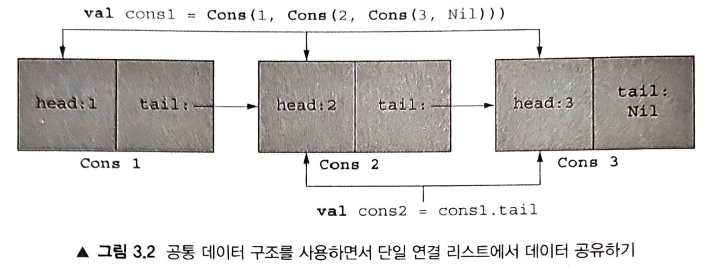

[3장. 함수형 데이터 구조]

### [목차]
* [3.1 함수형 데이터 구조 정의하기](#31-함수형-데이터-구조-정의하기)
  * [[변성에 대해]](#변성에-대해)
* [3.2 함수적 데이터 구조 다루기](#32-함수적-데이터-구조-다루기)
  * [[코틀린의 가변 개수 인자 함수]](#코틀린의-가변-개수-인자-함수)
  * [[동반 객체로 구현한 싱글턴]](#동반-객체로-구현한-싱글턴)
  * [3.2.1 타입으로 매칭하기 위한 'when'](#321-타입으로-매칭하기-위한-when)
  * [3.2.2 if-else를 대신하는 when](#322-if-else를-대신하는-when)
  * [3.2.3 패턴 매칭은 무엇이며 코틀린 매칭과 어떤 차이가 있나?](#323-패턴-매칭은-무엇이며-코틀린-매칭과-어떤-차이가-있나)
* [3.3 함수형 데이터 구조 안의 데이터 공유](#33-함수형-데이터-구조-안의-데이터-공유)
  * [(연습문제 3.1)](#연습문제-31)
  * [(연습문제 3.2)](#연습문제-32)
  * [3.3.1 데이터공유의효율](#331-데이터공유의효율)
  * [(연습문제 3.3)](#연습문제-33)
  * [(연습문제 3.4)](#연습문제-34)
  * [(연습문제 3.5)](#연습문제-35)
* [3.4 리스트에 대한 재귀와 이를 고차 함수로 일반화하는 방법](#34-리스트에-대한-재귀와-이를-고차-함수로-일반화하는-방법)
  * [(연습문제 3.6)](#연습문제-36)
  * [(연습문제 3.7)](#연습문제-37)
  * [(연습문제 3.8)](#연습문제-38)
  * [(연습문제 3.9)](#연습문제-39)
  * [(연습문제 3.10)](#연습문제-310)
  * [(연습문제 3.11)](#연습문제-311)
  * [(연습문제 3.12)](#연습문제-312)
  * [(연습문제 3.13)](#연습문제-313)
  * [(연습문제 3.14)](#연습문제-314)
  * [3.4.1 리스트에 작용하는 다른 함수들](#341-리스트에-작용하는-다른-함수들)
    * [(연습문제 3.15)](#연습문제-315)
    * [(연습문제 3.16)](#연습문제-316)
    * [(연습문제 3.17)](#연습문제-317)
    * [(연습문제 3.18)](#연습문제-318)
    * [(연습문제 3.19)](#연습문제-319)
    * [(연습문제 3.20)](#연습문제-320)
  * [[함수의 마지막 파라미터로 람다가 오는 경우]](#함수의-마지막-파라미터로-람다가-오는-경우)
    * [(연습문제 3.21)](#연습문제-321)
    * [(연습문제 3.22)](#연습문제-322)
  * [3.4.2 코틀린 표준 라이브러리의 리스트](#342-코틀린-표준-라이브러리의-리스트)
  * [3.4.3 단순한 요소들로부터 리스트 함수를 합성하는 데 따른 비효율](#343-단순한-요소들로부터-리스트-함수를-합성하는-데-따른-비효율)
    * [(연습문제 3.23)](#연습문제-323)
* [3.5 트리](#35-트리)
  * [[ADT와 캡슐화]](#ADT와-캡슐화)
    * [(연습문제 3.24)](#연습문제-324)
    * [(연습문제 3.25)](#연습문제-325)
    * [(연습문제 3.26)](#연습문제-326)
    * [(연습문제 3.27)](#연습문제-327)
    * [(연습문제 3.28)](#연습문제-328)
    * [(연습문제 3.29)](#연습문제-329)
* [[표준 라이브러리의 대수적 데이터 타입]](#표준-라이브러리의-대수적-데이터-타입)
* [요약](#요약)

[&emsp;> [to README]](../README.md)

---
<p align="right"><a href="#" class="btn--success">위로</a></p>

# 3장. 함수형 데이터 구조
* 1장 : 함수형 프로그램이 변수를 갱신하거나 가변 데이터 구조를 변경하지 않는다
  * 변수를 불변으로 유지한다는 점 강조
    * 함수형 프로그래밍에서는 어떤 유형의 데이터 구조 사용
    * 코틀린으로 어떻게 정의하고 조작?
* 이번 장 : 단일 연결 리스트, 트리[tree] 구현
  * 함수형 데이터 구조의 개념
  * 함수형 데이터 구조와 관련된 매칭[matching] 처리 기법 설명
  * 순수 함수 직성, 일반화하는 연습

* 순수 함수 작성하고 일반화하는 연습문제 다수
* 모든 예제와 연습문제 소스 코드 : http://github.com/fpinkotlin/fpinkotlin

---
<p align="right"><a href="#" class="btn--success">위로</a></p>

## 3.1 함수형 데이터 구조 정의하기
* 함수형 데이터 구조는 순수 함수만으로 조작됨. 
* 1장 : 순수 함수는 제자리에서 데이터를 변경하거나 부수 효과를 수행 - 안됨. 
* 함수형 데이터 구조 - 정의상 불변
  * 빈 리스트는 영원히 빈상태로 불변. 
  * 덧셈연산의 정수(3, 4)처럼, 3 + 4가 연산되는 정수(3, 4)를 변경하지 않고 새로운 수(7) 생성하듯, 
    * 두 리스트를 이어붙이면 새로운 리스트 생성, 입력된 두 리스트는 불변.
      * (두 리스트를 붙이는 구문도 a와 b가 리스트일 때 a + b로, 정수 덧셈과 동일)
  * 이 말(두 리스트를 붙히는) > 데이터 복사를 추가로 진행? '아니오' 
  * 예제설명 - 단일 연결 리스트 : 가장 널리 쓰이고 있을 함수형 데이터 구조 확인
    * 단순하고 추론하기 쉬우며 
    * 불변 데이터 구조에 깔린 원칙 잘 이해
  * 다음 코드는 새로운 문법과 개념을 제시하는데,이에 대해서는 자세히 설명

##### * [리스트 3.1 단일 연결 리스트 데이터 구조 정의]
```kotlin
sealed class List<out A> // ◄— 데이터 타입에 대한 봉인된 정의
object Nil : List<Nothing>() //◄—List의 Nil(빈 리스트) 구현
data class Cons<out A>(val head: A, val tail: List<A>) : List<A>() //◄— Cons도 List를 구현함
```
###### JKQ - Nil : (Next in line?) swift에서 적용된 참조null 대비 값의 빈정보를 나타내는 개념(으로 이해하자)

* 데이터 타입 정의 : sealed class 키워드로 시작
  * 보통 데이터 타입 : class 키워드들로 시작
  * List class 정의 : 내부에 메서드가 없음 
  * sealed를 클래스 선언 앞 표시 : 
    * 해당 클래스를 상속한 모든 구현이 같은 모듈의 같은 패키지[[1]](#1-패키지---옮긴이) 안에 있어야만 함
    * 봉인된 클래스 : (디폴트로) 추상 클래스
      * 봉인된 클래스(추상 클래스) 자신을 인스턴스화할 수 없음
      

* 봉인된 List 클래스 다음에는 두 가지 구현(또는 데이터 생성자[data constructor][[2]](#2-데이터-생성자---옮긴이))이 있다. 
* (그림 3.1 처럼) 
  * List는 Nil로 표현되는 빈 리스트
  * 비어 있지 않은 리스트 : 데이터 생성자 Cons(전통적으로 리스트에서 '만들다[construct]' 뜻 줄임말)에 의해 표현
    * 첫 번째 원소인 head(머리) 와 
    * 나머지 원소의 리스트인 tail(꼬리) 로 구성
      * 꼬리 : 빈 리스트 이거나 다른 Cons로 이뤄진 리스트
* 함수, 데이터 타입 모두 다형적일 수 있다. 
  * sealed class List 뒤에 타입 파라미터 <out A>를 덧붙이고 
  * 피라미터 A를 Cons 데이터 생성자 내부에서 사용
    * List를 그 안에 저장할 원소 타입에 따라 정의되는 다형적인 데이터 타입으로 생성
  * 이는 곧 여기서 본 동일한 정의 : 다양한 타입으로 생성 
    * Int가 원소인 데이터(List<lnt>라고 씀), Double이 원소인 데이터(List<Double>), String이 원소인 데이터(List<String>) 
      * (out : 타입 파라미터 A가 공변적[convariant]이라는 뜻 - [변성에 대해](#변성에-대해)
    * 데이터 생성자 선언 : 데이터 타입의 모양을 정의하는 함수 제공
    ```kotlin
    val exl: List<Double> = Nil
    val ex2: List<Int> = Cons(l, Nil)
    val ex3: List<String> = Cons("a", Cons("b", Nil))
    ```
* Nil이라는 object(싱글턴 객체) 사용
  * Nil : 빈 List 생성
  * data class Cons : 단일 연결 리스트 생성(원하는 길이)
    * `Cons(1, Nil)`, `Cons("a", Cons("b", Nil))` 등 
  * List : A라는 타입에 대해 파라미터화돼 있음
    * Nil과 Cons : 서로 다른 A 타입에 대해 인스턴스화될 수 있는 다형적 함수
      * ex2 : A 파라미터를 Int로 인스턴스화
      * ex3 : String으로 인스턴스화
      * ex1 : Nil은 List<Double> 타입으로 인스턴스화 
        * 빈 리스트를 원하는 타입 리스트로 대응 가능

###### [1] 패키지 - 옮긴이
* 과거 봉인된 클래스 정의와 모든 봉인된 하위 타입 계층 구조 :  한 파일로 구성. 
* 1.5부터 (한 파일이 아닌) 같은 모듈의 같은 패키지 안에만 있으면 되는 것으로 변경됨
  * 코틀린에서 모듈 : 한 번에 컴파일되는 모든 소스 파일
    - 명령줄에서 kotlin에 한꺼번에 전달해 컴파일하는 파일들
    - 그레이들에서 모듈로 묶인 소스파일 
    - 컴파일러가 한꺼번에 인식할 수 있는 파일들 의미
###### [2] 데이터 생성자 - 옮긴이
* (객체지향 생성자가 객체를 만들어내듯) 대수적 데이터 구조의 데이터 생성자 : 
  * 다른 값들로부터 새 데이터 값 생성
  * 본문 Cons : (타입A 원소와 타입B 원소를 저장하는) 리스트를 엮어 새로운 리스트 생성
    * 객체지향의 생성자와는 다른 개념
  * (어떤 면에서) 대수적 데이터 구조의 데이터 생성자 : 
    * 0개 이상의 값을 모으고 적절한 태그를 붙여 나중에 패턴 매칭에서 데이터의 유형을 구분할 수 있게 해주는 장치
    * 코틀린(객체지향 언어) : 봉인된 클래스의 상속 계층 구조와 그 계층 구조에 속한 클래스들의 생성자를 통해 
    * 태그 작업 진행 : 이 둘은 밀접한 관계를 구성


---
<p align="right"><a href="#" class="btn--success">위로</a></p>

###### [변성에 대해]
* `class List<out A>` - 타입 파라미터 A 앞에 있는 out : 
  * A가 List의 공변적, 또는 '양성적(positive)' 파라미터라는 신호를 보내는 변성 애너테이션
  * 예) Dog이 Animal의 하위 타입일 때 List<Dog>이 List<Animal>의 하위 타입으로 간주된다
    * (더 일반적으로 모든 타입 X, Y에 대해 X가 Y의 하위 타입이면 List<X>도 List<Y>의 하위 타입이다.) 
  * A 앞에 있는 out을 생략하면 List를 타입 파라미터에 대해 무공변(invariant)으로 만든다.
  * 리스트 정의 : Nil이 List<Nothing>을 확장 - Nothing은 모든 타입의 하위 타입
    * 하위 타입 관계와 A의 변성 애너테이션을 함께 고려
      * Nil : List<Int>로도 List<Double>로 간주될 수도 있다. 
      * 이런 성질은 우리가 원하는 성질과 일치
      * 변성 : 코틀린이 하위 타입 관계로 데이터 생성자를 인코딩하기 위해 만든 인공물
        * 분명 변성 애너테이션을 쓰지 않고도 코드를 작성가능
        * 때로 변성이 없으면 함수 시그니처가 더 단순
        * (반면 타입 추론은 더 나빠질 수 있다) 
      * 이 책에서는 
        * 변성 애너테이션을 써야 편리한 곳에 변성 애너테이션을 사용
        * 하지만 변성을 사용하는 방법과 그렇지 않은 방법을 모두 연습해보길 바란다.
      * 코틀린 제네릭스(공변성과 반공변성) 참고 : (https://kotlinlang.org/docs/generics.html)


* 데이터 구조에 대한 함수 작성 : 데이터가 Nil일 때와 Cons일 때 구분
  * (다양한 언어가 이럴 때 좀 더 쉽게) 데이터 생성자의 형태에 따라 서로 다른 동작 정의
    * 패턴 매칭 matching이라는 기능 제공 (다음 절에서는 when 식에서 어떻게 이를 수행할 수 있는지 확인)

---
<p align="right"><a href="#" class="btn--success">위로</a></p>

## 3.2 함수적 데이터 구조 다루기
* List를 '매칭' 기법으로 해석하고 처리

##### * [리스트 3,2 봉인된 List 타입 정의의 동반 객체]
```kotlin
sealed class List<out A> { // List 데이터 구조를 정의함
    companion object { // 함수가 포함된 동반 객체
        fun <A> of(vararg aa: A): List<A> { // 팩토리 도우미 함수
            val tail = aa.sliceArray(1 until aa.size)
            return if (aa.isEmpty()) Nil else Cons(aa[0], of(*tail))
        }
    }
}
```
* 동반 객체 정의 추가 : List 타입에 대한 동작 추가
  * companion object 블록 안에 정의된 함수 : 자바의 정적[static] 메서드와 비슷하게 호출
    * 예) of 메서드를 사용해 파라미터 값으로부터 새 List 생성
        ```text
        >>> List.of(l, 2)
        resG： chapters.List<kotlin.Int> = Cons(head=l, tail=Cons(head=2, tail=Nil))
        ```
    * vararg 키워드로 한정된 파라미터를 받음. 
    * vararg : 이 함수가 가변 개수인자를 받는[variadic] 함수라는 뜻
      * 이 파라미터 대신에 똑같은 타입(Int)의 파라미터를 원하는 개수만큼 전달할 수 있다(0개도 가능함). 
      * 전달한 파라미터들은 지정한 타입을 원소로 하는 배열[[3]](#3---옮긴이)에 저장돼 함수 본문에서 사용 가능. 
        * 참고 : [[코틀린의 가변 개수 인자 함수]](#코틀린의-가변-개수-인자-함수)

###### [3] - 옮긴이
* 일반적인 타입 : Array〈타입〉 으로 저장
* fun foo(vararg aa：T)에서 T가 
  * 제네릭 타입이나 일반 클래스 타입(String 이나 개발자가 직접 정의한 클래스 등 참조 타입)이 아니라 
  * Byte, Short, Int, Long, UByte, UShort, UInt, ULong, Float, Double, Boolean 타입인 경우 효율성을 위해
    * ByteArray, ShortArray, IntArray, LongArray, UByteArray, UShortArray, UIntArray, ULongArray, FloatArray, DoubleArray, BooleanArray 배열에 담김
  * 다만, 이들 모두 제네릭 배열 Array〈T〉와 같은 연산을 제공
  * 원하면 toTypedArray()를 통해 자신의 원소 타입에 상응하는 Array〈T〉로 바꿀 수 있다. 
  * 단, 여기서 설명한 구체적 배열 타입의 경우 Array〈T〉형태의 제네릭 배열로 바꾸면 
    * 훨씬 효율이 떨어지고 메모리도 많이 차지
    * 제안 : 배열 타입(`ByteArray`)을 바꿔서(`toTypedArray()`) 사용하기보다는 원래 배열 타입(`Byte`)을 최대한 그대로 활용

---
<p align="right"><a href="#" class="btn--success">위로</a></p>

###### [코틀린의 가변 개수 인자 함수]
* List 동반 객체의 of 함수 : 새 List 인스턴스를 만드는 팩토리 메서드
* 메서드(`of`) : 가변 개수 인자 함수 - (A 타입의 인자를 0개 이상 받을 수 있다)
  * 인자 제공 없음 : List의 Nil 인스턴스 응답
  * 인자 제공 : 전달된 인자값들을 표현하는 Cons 응답
    ```kotlin
    fun <A> of(vararg aa: A): List<A> {
        val tail = aa.sliceArray(1 until aa.size)
        return if (aa.isEmpty()) Nil else Cons(aa[0], List.of(*tail))
    }
    ```
  * 데이터 타입의 인스턴스 : 편리하게 구성할 수 있도록 동반 객체에 of 메서드를 정의하는 경우
    * 함수 이름 : of 
    * 동반 객체에 위치
      * List.of(1, 2, 3, 4), List.of("hi","bye") : 원하는 값을 콤마로 구분
      * 리스트를 생성하는 구문 사용
  * 메서드의 aa 파라미터 키워드가 : vararg
    * 메서드 파라미터에서 aa의 타입이 A임에도 메서드 본문에서 : aa를 Array<A>로 사용
      * Array 타입이 제공하는 sliceArray를 활용해 tail에 해당하는 새 Array를 얻을 수 있다.
  * 배열을 가변 개수 인자 함수로 전달 가능. 
    * 스프레드 연산자[spread operator] * 사용
    * of 재귀적 호출 : *tail 전달
    * 배열 사용 방법 참고 : 
      * https://kotlinlang.org/docs/basic-types.html#arrays
      * https://kotlinlang.org/docs/arrays.html


---

* 함수 sum과 product : 동반 객체 안에 이 두 함수 추가 - 두 함수정의 모두 when 식 매칭 기법 사용

##### * [리스트 3.3 List 동반 객체 안에 있는 함수 정의]
```kotlin
fun sum(ints: List<Int>): Int =
    when (ints) {
        is Nil -> 0
        is Cons -> ints.head + sum(ints.tail)
    }
fun product(doubles: List<Double>): Double =
    when (doubles) {
        is Nil -> 1.0
        is Cons ->
            if (doubles.head == 0.0) 0.0
            else doubles.head * product(doubles.tail)
    }

```

* sum 함수 : 
  * 빈 배열 합계 표현 : 0 
  * 비어 있지 않은 배열 합계 표현 : 첫 원소와 나머지 원소들의 합계를 더한 값
* product 함수 : 
  * 빈 배열의 원소 곱 : 1.0 
  * 0.0부터 시작한 배열의 모든 원소의 곱 : 0.0
  * 비어 있지 않은 배열의 첫 원소가 0.0이 아닌 경우 표현 : 재귀적인 정의
    * 전체 원소 곱은 배열 첫 번째 원소와 나머지 모든 원소들의 곱을 곱한 값 
  * 재귀적인 데이터 타입(List)에 대한 연산 작성할 때 재귀적인 정의가 일반적
    * (Cons 데이터 생성자 : List 데이터 타입 자신을 재귀적 지시)


---
<p align="right"><a href="#" class="btn--success">위로</a></p>

###### [동반 객체로 구현한 싱글턴]
* 클래스 안에 있는 companion object 블록 : 
  * 이름이 붙은 인스턴스가 단 하나
  * 같은 이름의 class 싱글턴 객체 선언
* 자바 싱글턴 객체에 익숙한 독자 : 코틀린보다 자바에서 싱글턴을 선언하는 게 훨씬 더 번잡하다
* 코틀린 싱글턴 : 
  * 객체 본문에서 스레드 안전성 보장을 위해 2중 검사 잠금(double checked locking) 불필요
  * 자바보다 안전
  * 자바의 static 키워드에 해당하는 것 없음
  * 자바에서 static 멤버로 정의할 법한 부분을 코틀린 동반 객체 안에 정의
  * 데이터 타입과 데이터 생성자 안에 동반 객체를 선언
  * 동반 객체 선언 : 데이터 타입(여기서는 List)과 같은 이름의 (싱글턴) 객체가 생기
    * 해당 데이터 타입 값에 적용할수 있는 여러 가지 편의 메서드 추가
    * 예) n개의 a로 이뤄진 List를 돌려주는 `fun <A> fill(n: Int, a: A): List<A>`가 필요하다면. 
      * List 동반 객체 안에 이 메서드를 넣는 게 좋다. 
      * 이런 목적으로 Foo라는 별도의 객체 생성 가능, 
      * List의 동반 객체 사용 : 그 안에 들어 있는 모든 함수가 리스트와 관련 있는 함수라는 사실을 더 명시적으로 표현

###### [4] 리스트와 별도로 정의된 Foo 객체는 List에서 private으로 선언된 프로퍼티나 메서드를 볼 수 없다. - 옮긴이

* 코틀린 : when 식을 통해 매칭 수행
  * when : 약간 멋진 switch 문
    * 인자로 받은 값을 갖고 조건을 만족하는 가지가 나타날 때까지 순서대로 각 가지의 조건을 계산한다. 
    * 조건을 만족하는 가지가 있으면, 그 가지의 값(-> 다음에 있는 식을 계산한 값) 이 전체 when의 결과값
    * 조건을 만족하는 가지가 없으면, else 가지 계산 결과가 전체 when 식의 값
    * 컴파일러가 when의 모든 가지에 있는 조건이 인자로 받은값에 대해 평가할 수 있는 모든 경우를 처리한다고 증명할 수 없는 한, 
      * else가 꼭 필요하다.
    * 매칭 : 값 검사 목적을 위해 몇 가지 매칭 방법 사용
      * 상수값과 매칭, 식이나 범위, 타입에 대해 매칭
    * when : 좀 더 향상된 if-else 식처럼 사용가능
    * 함수형 프로그래밍 - 필요한 매칭 방법만 다루자


---
<p align="right"><a href="#" class="btn--success">위로</a></p>

### 3.2.1 타입으로 매칭하기 위한 'when'
* 타입에 따라 매칭
  * is 키워드 사용 : 각 논리 가지에서 구체적인 타입 검사
  * 타입 일치 : 대상 값이 각 가지에 필요한 구체적 타입으로 스마트캐스트[smartcast]됨.
    * when 대상 값이 화살표(-＞)의 (일치된) 왼쪽 타입으로 캐스트
    * 각 가지의 오른쪽 (식) 부분에서 쓰일 수 있다.
* 예제)

##### * [리스트 3.4 구체적 구현으로 스마트캐스트시켜 사용하기]
```kotlin
val ints = List.of(l, 2, 3, 4) // 추상 List 선언
fun sum(xs: List<Int>): Int =
    when (xs) {
        is Nil -> 0 // Nil 구현과 매치
        is Cons -> xs.head + sum(xs.tail) // Cons 구현으로 스마트캐스트
}
fun main() = sum(ints) // 리스트에 대해 sum 함수 호출

```
* ints 값의 타입 : List
  * ints 값 : Cons일 or Nil(빈 리스트 생성 시) 
  * when에서 각 논리 가지 중 하나와 일치하기 전까지 
    * 이 값의 타입은 추상적 인 List 타입으로 간주
  * Nil과 일치한 경우에는 그냥 0 반환
  * Cons와 일치하면 흥미로운 일이 발생한다. 
    * 해당 가지의 왼쪽에서 오른쪽으로 가면서 ints가 자동으로 Cons로 캐스트
      * head나 tail 같은 멤버에 접근가능! : 스마트캐스트
      * 클래스 계층에 있는 여러 하위 타입이 서로 다른 필드가 담긴 데이터 생성자로 이뤄져 있을 때 중요한 역할
      * 반드시 모든 타입을 완전히 검사
      * 봉인된 기반 클래스인 List의 모든 구현을 검사
  * 작성한 매칭이 완전하지 않다는 사실이 드러나면
    * (sealed가 붙지 않은 여러 클래스에 대한 매칭 시도
    *  sealed로 표시된 기반 클래스의 모든 변종을 검사하지 않은 경우) 
    * 나머지 모든 경우를 잡아내기 위해 else 조건 명시
    * List의 경우 봉인된 클래스 : Nil과 Cons 구현밖에 존재하지 않으므로 else 추가 불필요


---
<p align="right"><a href="#" class="btn--success">위로</a></p>

### 3.2.2 if-else를 대신하는 when
* when 활용 다른 방법 : 더 단순한 if-else 식 작성
  * when 키워드 뒤에 피라미터가 불필요 
  * (if-else와 마찬가지로) when도 값을 만들어내는 식
  * 예) 간단한 if 식
##### * [리스트 3.5 신을 평가하기 위한 논리석인 if-else 사습]
```kotlin
val x = Random.nextInt(-10, 10)
val y: String =
    if (x == 6) { // x가 0인지 검사
        "x is zero"
    } else if (x < 0) { // x가 음수인지 검사
        "is negative"
    } else { // 다른 경우 노는 양수일 수밖에 없음
      "x is positive"
    }
```
* 주변을 둘러싼 부가적 인 코드로 인해 복잡
  * when을 사용
##### * [리스트 3.6 식을 평가하기 위해 when 사용하기 으 ' ' ']
```kotlin
val x = Random.nextInt(-10, 10)
val y: String =
    when { // whenoil 파라미터를 전달하지 않음
        x == 0 ->  // if-else 식을 대신하는 논리 가지들
            "x is zero"
        x < 0 ->   // if-else 식을 대신하는 논리 가지들
            "x is negative"
        else ->    // 모든 경우를 처리하는 else 가지
            "x is positive"
}

```
* 현재 영역에서 볼 수 있는 모든 변수에 대해 이 구조 적용가능
  * 난수 x에 대해 조건 나열
  * 화살표 왼쪽의 논리 식(`x == 0`, `x < 0`) : Boolean 결과 응답, 
    * 값에 따라 화살표 왼쪽 값 중 하나 계산
    * 전체 when : 식 - 결과를 y에 대입 가능
    * 이 코드가 훨씬 더 우아하고 간결 - 읽기 쉽고 조건 추론에 용이 (단점도 있지만)

---
<p align="right"><a href="#" class="btn--success">위로</a></p>

### 3.2.3 패턴 매칭은 무엇이며 코틀린 매칭과 어떤 차이가 있나?
* 코틀린 매칭 : 완전하지 않음
  * 다른 언어들이 제공하는 매칭과 비슷한 프로그램 요소와 비교하면 모자란 점이 많다. 
* 하스켈, 스칼라, 러스트 등의 언어는 패턴 매칭[pattem matching]이 기능 제공
  * 패턴 매칭 : 코틀린 매칭과 비슷 - 의미론적으로도 더 낫고 할 수 있는 일도 더 많으며 코틀린의 매칭보다 더 쓰기 편하다. 
  * 코틀린 when이 제공하는 매칭과 다른 언어가 매칭을 처리하는 방법을 비교 : 단점을 살펴보자.
  * 패턴 매칭 : 논리 식과 어떤 패턴을 일치시킬 뿐 아니라 식으로부터 값 추출 가능
    * 추출, 또는 구조 분해[destructuring] : Fp에서 특히 대수적 데이터 타입을 다룰 때 중요한 역할
    * 패턴 매칭 작동방법 이해를 위해, 
      * 코틀린 when을 사용해 작성한 코드와 패턴 매칭 기법을 적용해 코틀린으로 작성할 경우 '이랬으면 좋을 텐데' 하고
      * 바라는 코드를 자세히 살펴보자.
  
* List 클래스의 동반 객체에 작성한 sum 함수 확인
##### * [리스트 3.7 List 동반 객체에서 사용한 단순한 when 매칭]
```kotlin
fun sum(xs: List<Int>): Int =
  when (xs) {
    is Nil -> 0
    is Cons -> xs.head + sum(xs.tail) // Cons를 매칭한 다음 xs가 스마트캐스트됨 > head와 tail을 볼 수 있음
  }

```
* 여기서 기장 잘 알 수 있는 문제는 매칭이 이뤄진 다음에 XS 내부 값을 xs.head와 xs.
  tail로 접근한다는 점이다. xs기- List로 선언됐으므로 head나 tail이 없다. List가 Cons로
  스마트캐스트된다는 시실을 명시하지는 않았기 때문에 xs의 타입이 모호해 보여서 혼란을
  야기할 수 있다

다른 언어처럼 코틀린도 패턴 매칭을 지원한다면 다음과 같은 코틀린 의사코드로 같은
힘-수를 직-성할수 있을것이다.
[리스트 3.8 의사코드를 사용해 List 해턴 배칭하기]
fun sum(xs: List): Int = when(xs) {
case Nil -> 0 그— — 첫 번째 패턴 Nil. 뽑아내는 값 없음
case Cons(head, tail) -> head + sum(tail) )두 번째 패턴 cons(head, tail), head와
} I tail을 뽑아냄
새 case 키워드 뒤에 패턴 선언이 온다는 사실을 알 수 있다. 여기서 Nil과 Cons(head,
tail)이 패턴이다. 이 패턴이 값과 일치해야 한다. 코드를 실행할 때 when의 파라미터에 대
해 각 가지에 있는 패턴을 순서대로 적용해본다. 파라미터가 어떤 가지의 패턴과 일치하지
않으면 그냥 다음 가지로 넘어간다. 패턴이 일치하면, 패턴을 적용하면서 파라미터 객체에
있는 필드를 뽑아낸 후 변수에 담고 해당 가지의 오른쪽에 있는 수식에서 변수를 사용할 수
있게 해준다.
이 패턴 매칭 구조의 인자로 Cons(l, Cons(2, Nil))이라는 구조의 List 객체가 전달된다
고 하자. Nil 패턴은 이 객체와 일치하지 않으므로 두 번째 패턴으로 넘어간다. Cons 데이터
클래스 정의에는 다음과 같은 주 생성자 정의가 있다는 점을 기 억하자.
data class Cons<out A>(val head: A, val tail: List<A>) : List<A>()
생성자 (val head: A, val tail: List<A>)를 (패턴 매칭에 전달된) 객체에 겹쳐보면서 head
와 tail 값을 추출한다. 여기서는 Int 타입의 head로 1이라는 값이, List<Int> 타입의 tail로
Cons(2, Nil)이 추출된다. 이 두 값이 head와 tail이라는 변수에 담기고 조건식 오른쪽에서
는 when의 파라미터로 전달된 객체인 xs에 접근하지 않아도 이 두 변수를 사용해 원하는 계
산을 수행할 수 있다.
처음에는 이런 논리 전환이 그다지 대딘해 보이지 않는다. 하지만 패턴 매칭이 있는지
여부는 이런 류의 매칭이 필요한 코드에 접근하는 방식에 큰 영향을 끼친다. 패턴 매칭이
있다면 일치가 일어난 xs에 접근할 필요가 없고, 필드에 접근하기 위해 스마트캐스트를 쓸
필요도 없다. 대신 긱긱의 필드를 직접 시용할 수 있으며, 원하는 값을 평가할 때 소으에 손댈필요가 없다.
코틀린 언어에 패턴 매칭을 포함시켜달라는 요청이 많이 있었지만(예를 들어 웹 사이트
(https://clisc11ss.k0tlinkmg.0rg/t/destr11ct11rlng-in-when/2391)), 코틀린 창시자들은 언어가 너
무 복잡해질 수 있다고 주장하면서 이런 의견에 굳건히 반대하고 있다. 우리(이 책의 저자들)
는 미래에 패턴 매칭이 코틀린 언어에 포함되길 간절히 원하고 있다.


---
<p align="right"><a href="#" class="btn--success">위로</a></p>

## 3.3 함수형 데이터 구조 안의 데이터 공유
*
데이터가 불변이면 어떻게 리스트에 원소를 추가하거나 리스트에서 원소를 제거하는 함수
를 작성할 수 있을까? 해답은 간단하다. 기존 리스트(말하자면 XS)의 앞에 1이라는 원소를 추
가하면 Cons(l, 소이라는 새 리스트를 돌려주면 된다. 리스트가 불변이므로 실제로는 XS를
복사할 필요가 없다. 단지 xs를 재사용하면 된다. 이를 데이터 공유라고 한다. 불변 데이터
를 공유하면 함수를 더 효율적으로 구현할 수 있는 경우가 자주 있다. 향후 다른 코드에서
데이터를 변경할지도 모른다는 걱정을 하지 않고 데이터를 반환할 수 있으며, 데이터 변경
이나 오염을 피하기 위해 비관적으로 복사본을 만들 필요가 없다. 데이터 구조가 불변이기
때문에 복사본은 불필요하다.

[노트] 큰 프로그램에서는 비관적 복사가 문제가 될 수 있다. 가변 데이터가 서로 느슨하게 연결된
컴포넌트의 사슬을 통해 전달될 때 각 컴포넌트는 다른 컴포넌트가 데이터를 변경할지 모르기 때문
에 데이터 복사본을 유지해야 한다. 불변 데이터는 공유가 돼도 안전하므로 결코 복사를 할 필요가
없다. 전체적으로 드으가 부수 효과에 의존하는 접근 방법보다 더 큰 효율을 달성할 수 있다고 보는데,
데이터나 계산을 더 많이 공유할 수 있기 때문이다.

마찬가지 방법으로, mylist = Cons(x, xs)인 리스트 맨 앞에서 원소를 제거하기 위해서
는 tail인 xs를 반환하면 된디-. 여기서는 아무 데이터 이동도 일어나지 않는다. 원래 리스
트 mylist는 바뀌지 않고, 여전히 쓸 수 있다. 함수형 데이터 구조는 영속적Persistent이다. 영
속적이라는 말은 존재히는 (힘수적 데이터 구조에 대한) 참조가 데이터 구조에 대한 연산을 수
행한 다음에도 결코 바뀌지 않고 원래대로 남는다는 뜻이다. 그림 3.2는 이런 데이터 구조의 영속적인 성격을 보여준다.



리스트를 여러 가지 방법으로 변경하는 함수를 몇 가지 구현해보자. 우리가 연습문제로
작성할 함수들은 두 가지 방법으로 작성할 수 있으며 어느 방법을 택해도 좋다. 첫 번째 접
근 방법은 suK］나 product처럼 List 동반 객체 안에 함수를 위치시키는 방법이다. 이 방법
을 사용해 정의한 메서드는 첫 번째 인자로 받은 리스트에 대해 작용해야 한다.
fun <A> tail(xs: List<A>): List<A> = TODO()
>>> val xs = List.of(lj. 2, 3, 4)
»> List.tail(xs)
다른 접근 방법은 앞 장에서 소개한 확장 메서드를 사용하는 것이다. 이 렇게 하면 리스
트 타입 자체에 행동을 추가할 수 있으며 다음과 같은 형태로 리스트 객체에 메서드를 적용
할수있다.5
fun <A> List<A>.tail(): List<A> = TODO()
>>> xs .tail()

5 확장 힘수의 경우 리스트의 공개(public) 필드와 메서드만 사용할 수 있다. 봉인된 타입 계층에서 어떤 데이터 생성자를
data class로 정의한 경우. 모든 필드가 Public val 필드로 노출되기 때문에 확장 함수에서도 모든 필드에 접근할 수 있어
이 책에서는 별다른 설명 없이 확장 함수를 사용한다- — 옮긴이


---
<p align="right"><a href="#" class="btn--success">위로</a></p>

###### (연습문제 3.1)
* List의 첫 번째 원소를 제거히는 tail 함수를 구현히라. 이 함수는 상수 시간=stant time에
  실행이 끝나야 한다. List가 Nil일 때 선택할 수 있는 여러 가지 처리 방법을 생각해보라.
  다음 장에서 이 경우(함수가 정상 작동하지 못하는 경우)를 다시 살펴본다.
  fun <A> tail(xs: List<A>): List<A> =
  SOLUTION_HERE()


---
<p align="right"><a href="#" class="btn--success">위로</a></p>

###### (연습문제 3.2)
* 연습문제 3.1과 같은 아이디어를 사용해 List의 첫 원소를 다른 값으로 대치하는 setHead
  함수를 작성하라.* 6
  fun <A> setHead(xs: List<A>, x: A): List<A> =
  S0LUTI0N_HERE()


---
<p align="right"><a href="#" class="btn--success">위로</a></p>

### 3.3.1 데이터공유의효율
* 2.3절에서 본 것처럼, 우리가 다루는 데이터 구조의 불변성으로 인해 데이터 공유를 사용
  할 때 연산을 더 효율적으로 구현할 수 있는 경우가 자주 있다. 몇 가지 예를 살펴보자.
  
* 6 (힌트) 함수형 프로그래밍에서는 제자리 변경을 사용하지 않는다는 점을 다시 한번 기억하라. 제자리 변경이라는 선택지
  를 제외시키면, 리스트의 첫 원소를 다른 값으로 바꾼다는 말은 첫 번째 원소만 다르고 나머지 구조가 같은 새 리스트를
  만든다는 뜻이 될 수밖에 없다. 이때 나머지 리스트의 모든 원소를 굳이 복사할 필요가 있는지를 한번 고민해보라. - 옮
  긴이


---
<p align="right"><a href="#" class="btn--success">위로</a></p>

###### (연습문제 3.3)
* tail을 더 일빈회히］ 서 drop 함수를 직-성히리-. drop은 리스트 맨 앞부터 이개 원소를 제거한
  디-. 이 함수는 식제할 원소의 개수에 비례헤 시간이 걸린다는 사실(따라서 여러분이 건체 List
  를 복사할 필요가 없디는 사실)을 일아두라.
  fun <A> drop(l: List<A>, n: Int)： List<A> =
  SOLUTION_HERE()


---
<p align="right"><a href="#" class="btn--success">위로</a></p>

###### (연습문제 3.4)
* dropWhile을 구현하라. 이 함수는 List의 맨 앞에서부터 주어진 술어를 만족(술어 함수가 true
  를 반환)하는 연속적인 원소를 삭제한다. (다른 말로 하면, 이 함수는 주어진 술어를 만족하는 접두
  사를 List에서 제거한다.)
  fun <A> dropWhile(l: List<A>, f: (A) -> Boolean): List<A> =
  SOLUTION_HERE()


아이)과 하야01：116은 목표를 달성하기 위해 데이터 공유를 채택한다. 데이터 공유를 쓰는
더 놀라운 예제로 한 리스트의 모든 원소를 다른 리스트 뒤에 덧붙이는 다음 함수를 들 수
있다


[리스트 3.9 한 리스트의 모든 원소를 다른 리스트 뒤에 덧붙이기]
fun <A> append(al: List<A>, a2： List<A>)： List<A> =
when (al) {
is Nil -> a2
is Cons -> Cons(al.head, append(al.tail, a2))
}

이 정의는 첫 번째 리스트의 원소를 소진할 때까지만 값을 복사한다는 점에 유의하라.
따라서 이 함수의 실행 시간과 메모리 시용량은 al의 길이에 의해서만 결정된다. (복사된 리
스트의) 나머지 리스트는 a2를 가리키기만 한디-. 같은 기능을 배열로 구현한다면 두 배열의
모든 원소를 결과 배열에 복사해야 한다. 이런 경우 불변 연결 리스트가 배열보다 훨씬 효
율적이다!


---
<p align="right"><a href="#" class="btn--success">위로</a></p>

###### (연습문제 3.5)
* 코드가 리스트를 연결하는 코드의 경우처럼 항상 제대로 작동하는 것은 아니다. 어떤 List
  에서 마지막 원소를 제외한 나머지 모든 원소로 이뤄진 (순서는 동일한) 새 List를 반환하는
  init 함수를 정의하라. 예를 들어 List(l, 2, 3, 4)에 대해 init은 List(l, 2, 3)을돌려줘
  야 한다. 이 함수를 tail처럼 상수 시간에 구현할 수 없는 이유는 무엇일까?
  fun <A> init(l: List<A>): List<A> =
  SOLUTION_HERE()


   단일 연결 리스트의 구조로 인해 어떤 Cons의 tail을 변경할 때마다 해당 Cons가 리스트
  의 맨 마지막에 위치한 Cons라 할지라도, 더 앞에 있던 모든 Cons 객체를 복사해야만 한다.
  여러 다른 연산을 효율적으로 제공하는 순수 함수형 데이터 구조를 작성하는 것은 데이터
  공유를 영리하게 활용할 방법을 찾아내는 것과 같다. 여기서 이런 데이터 구조를 더 자세히
  다루지는 않으므로, 일단은 다른 사람들이 작성해놓은 함수형 데이터 구조를 사용하는 것
  으로 만족하자.7

7 이런 함수형 데이터 구조를 다룬 가장 유명한 책으로는 크리스 오카사키(Chris Okasaki)가 저술하고 이 책의 역자(오현
석) 가 번역한 '■순수 함수형 데이터 구조,(에이콘, 2019)를 들 수 있다. 이 책은 어렵지만 여러 가지 흥미로운 함수형 데이
터 설계 방법을 다루고 있으므로 읽어볼 만한 가치가 있다. — 옮긴이

---
<p align="right"><a href="#" class="btn--success">위로</a></p>

## 3.4 리스트에 대한 재귀와 이를 고차 함수로 일반화하는 방법
* sum괴- product 구현을 다시 보지-. 이 두 함수는 수행히는 일고］ - 처 리 방법이 매우 비슷하다.
  디음으로는 이들의 공통점을 뽑아내어 두 함수에 대한 고차 함수를 만들어보자.
  두 함수의 구현을 나란히 비교하기 위해 0.0에 대한 쇼트 서킷5hort %cuit8을 제거한 약간
  디른 product 구현을 실펴보자.
* 
  [리스트 으.10 쇼트 서킷을 제거함으로써 product 정규화하기]
  fun sum(xs: List<Int>): Int = when (xs) {
  is Nil -> 0
  is Cons -> xs.head + sum(xs.tail)
  }
  fun product(xs: List<Double>): Double = when (xs) {
  is Nil -> 1.0
  is Cons -> xs.head * product(xs.tail)
  }
* 
  두 함수가 얼마나 많이 닮았는가! 이들은 List<lnt>와 List<Double>이라는 서로 다른 타
  입에 작용한다. 타입을 제외하면 유일한 차이는 빈 리스트에 대해 반환하는 값(sum에서는 0.
  product에서는 1.0)과 결과를 합치는 연산(sum에서는 + 연산, product에서는 * 연산)뿐이다. 이와
  같은 중복이 보일 때마다 하위 식을 함수 인자로 뽑아냄으로써 코드를 일반화할 수 있다.
  하위식이 어떤 지역 변수들을 참조한다고 가정하자(sum에서 + 연산자는 두 값을 더하고.
  product에서 * 연산자는 두 값을 곱한다). 그런 경우 이 하위식을 각 식이 참조하는 변수들을 인
  자로 받는 함수로 바꿀 수 있다. 지금 그렇게 해보자. 우리 함수는 빈 리스트의 경우 반환해
  야 하는 값과 비어 있지 않은 리스트의 각 원소를 하나씩 결과에 추가{덧셈이 아니라 연산을
  수행해 결과에 반영한디는 뜻이다)해나기는 함수를 인자로 받는다.

8 쇼트 서킷은 '단락'을 의미하는 용어로, 전기 회로에서 한 부분이 다른 소자(저항 등)를 거치지 않고 직접 연결되는 것을
말한다. 프로그래밍에서는 특정 경우에 복잡한 계산을 거치지 않고 즉시 답을 내놓는 코드를 쇼트 서킷이라고 부른다. 예
를 들어 불린 식 e1 && e2에서 e1을 계산한 결과가 거짓이면, e2를 굳이 계산하지 않아도 전체가 거짓임이 확정되므로
e2 식을 아예 평가하지 않고 false를 내놓는다. - 옮긴

[리스트 3.11 foldRIghtt 사용해 product와 sum 일반화하끼]
fun <A, B> foldRight(xs: List<A>, z: B, f: (A, B) -> B): B =
when (xs) (
is Nil -> z
is Cons -> f(xs.head, foldRight(xs.tail, z, f))
}
fun sum2(ints: List<Int>): Int =
foldRight(ints, 0, { a, b -> a + b })
fun product2(dbs: List<Double>): Double =
foldRight(dbs, 1.0, { a, b -> a * b })

foldRight는 원소의 구체적 타입에 따른 특별한 처리를 하지 않는다. 일반화를 하는 과
정에서는 반환할 값이 리스트의 원소와 같은 타입일 필요가 없다는 사실을 알았다!
foldRight가 하는 일을 묘사하는 한 가지 방법은 foldRight에 전달된 인자로 리스트 생성자
를 대치하는 것이다. 1장에서 배운 치환 모델에 따르면 Nil은 그로, Cons는 두로 치환해 다음
과 같은 결과를 얻을수 있다.
Cons(l, Cons(2, Nil))
f (1, f (2, z ))
최종 결과를 얻을 때까지 체계적으로 평가 값을 치환하는 완전한 예제를 살펴보자. 다
음 선언을 평가하는 과정을 앞에서 본 치환 모델을 통해 추적하자.
foldRight(Cons(l, Cons(2, Cons(3, Nil))),
0, { x, y -> x + y })
각 foldRight 호출을 함수 본문으로 치환하자. 이런 치환 기 법을 이 책 전반에 걸쳐 볼
수 있다.
foldRight(Cons(1, Cons(2, Cons(3, Nil))),
0, { x, y -> x + y })
1 + foldRight(Cons(2, Cons(3, Nil)), 0,
{ x, y -> x + y })

1 + (2 + foldRight(Cons(3, Nil), 0,
{ x, y -> x + y }))
1 + (2 + (3 + (foldRight(Nil as List<Int>, 0,
{ x, y -> x + y }))))
1 + (2 + (3 + (0)))
6

foldRight는 리스트의 맨 끝까지 모든 원소를 순회하고(순회 과정에서 스택에 프레임을 쌓아
야한다), 그 후 익명 함수를 적용하면서 한 값으로 축약된다는 사실을 알아두라.
여기서 foldRight를 재귀 호출할 때 익명 함수 파라미터를 전달하는 구문으로 { x, y ->
x + y }라는 람다를 썼다. 이때 두의 모든 파라미터 타입을 추론할 수 있기 때문에 스와 오에
타입을 적을 필요가 없다.


---
<p align="right"><a href="#" class="btn--success">위로</a></p>

###### (연습문제 3.6)
* foldRight로 구현된 product가 리스트 원소로 0.0을 만나면 재귀를 즉시 중단하고 결과를
  돌려줄 수 있는가? 즉시 결과를 돌려줄 수 있거나 돌려줄 수 없는 이유는 무엇인가? 긴 리
  스트에 대해 쇼트 서킷을 제공할 수 있으면 어떤 장점이 있을지 생각해보라. 5장에서는 이
  질문이 내포하고 있는 의미를 더 자세히 살펴본다.


---
<p align="right"><a href="#" class="btn--success">위로</a></p>

###### (연습문제 3.7)
* 다음과 같이 Nil과 Cons를 foldRight에 넘길 때 각각 어떤 일이 벌어지는지 살펴보라. (여기
  서는 Nil as 1_코$1:<101:>라고 타입을 명시해야 한다. 그렇지 않으면 코틀린이 foldRight의 B 타입 파라미터
  를 List<Nothing>으로 추론한다.)

foldRight(
Cons(l, Cons(2, Cons(3, Nil))),
Nil as List<Int>,
{ x, y -> Cons(x, y) }
)

이 결과가 foldRight와 List 데이터 생성자 사이에 존재하는 관계를 어떻게 보여주는
와 관련해 여러분의 생각을 밀히라.
이 문맥에서 단순히 Nil을 전딜하는 것은 A의 타입 정보가 부족하기 때문에 충분하지 않
디-. 그로 인해 Nil as List<Int>라고 적을 필요가 있다. 이런 코드는 번잡스럽기 때문에 동
반 객체 안에 이를 회피하기 위해 다음과 같은 편의 메서드를 추가할 수 있다.
fun <A> empty(): List<A> = Nil
이제부터 모든 예제 코드와 연습문제에서 빈 리스트를 표현하기 위해 이 메서드를 사용
할것이다.


---
<p align="right"><a href="#" class="btn--success">위로</a></p>

###### (연습문제 3.8)
* foldRight를 사용해 리스트 길이를 계산하라.
  fun <A> length(xs: List<A>): Int =
  SOLUTION_HERE()

| 경과 여기서부터 연습문제 난이도가 급격히 높아진다. 많은 경우 연습문제가 지식 한계를 넘어서
도록 여러분을 밀어붙일 것이다. 따라서 연습문제를 풀 수 없더라도 아무 문제가 없으며. 상당수 독자
가 연습문제를 풀 수 없으리라는 것은 이미 예상한 바다. 단지 각각을 풀기 위해 최선을 다하고. 실제
로 성공하지 못한 경우 부록 B에서 해답과 문제를 해결하는 적절한 방법을 살펴보라. 앞에서 말했듯
이 해답을 살펴보는 것은 최후의 방법이거나 여러분이 작성한 최종 답안을 검증하기 위한 것이어야
한다. 그리고 각 연습문제는 이전 연습문제에서 배운 내용을 바탕으로 구성된 것이므로 건너뛰지 말
아야 한다, 각 장의 모든 연습문제를 풀어봤을 때만 해당 장의 내용을 온전히 이해할 수 있다. 이 책
에서는 이런 상황(연습문제를 통해 본문을 이해하게 되는 상황) 이 계속된다

---
<p align="right"><a href="#" class="btn--success">위로</a></p>

###### (연습문제 3.9)
* 우리가 구현힌- foldRight는 꼬리 재구|가 아니므로 리스트가 긴 경우 StackOverflowError를
  발생시킨다(이를 스택 안전5tack-safe히지 않다고 말한다) . 정말 우리 구현이 스택 안전하지 않은
  지 획인히리-. 그 후 다른 리스트 재귀 함수 foldLeft를 2장에서 설명한 기법을 사용해 꼬리
  재귀로 직성히-리-. 디음은 foldLeft의 시그니처다.
  tailrec fun <A, B> foldLeft(xs： List<A>, z: B, f: (B, A) -> B): B =
  SOLUTION_HERE()


---
<p align="right"><a href="#" class="btn--success">위로</a></p>

###### (연습문제 3.10)
* foldLeft를 시용해 sum, product, 리스트 길이 계산 함수를 작성하라.


---
<p align="right"><a href="#" class="btn--success">위로</a></p>

###### (연습문제 3.11)
* 리스트 순서를 뒤집은 새 리스트를 반환하는 함수(List(l, 2, 3)이 주어지면 List(3, 2, 1)을 반
  환｝ 를 작성하라. 이 함수를 접기 연산유0161(《코으111：와 〒01011_0〒브를 합쳐서 접기 연산이라고 한다)을 사'
  용해 작성할 수 있는지 살펴보라.


---
<p align="right"><a href="#" class="btn--success">위로</a></p>

###### (연습문제 3.12)
* 어려움: foldLeft를 foldRight를 사용해 작성할 수 있는가? 반대로 foldRight를 foldLeft를
  사용해 작성할 수 있는가? foldRight를 foldLeft로 구현하면 foldRight를 꼬리 재귀로 구현
  할 수 있기 때문에 유용하다. 이 말은 큰 리스트를 스택 오버플로를 일으키지 않고
  foldRight로 처리할 수 있다는 뜻이다.


---
<p align="right"><a href="#" class="btn--success">위로</a></p>

###### (연습문제 3.13)
* append를 fold Left니- foldRight를 스|영-히| 구현츠) -라


---
<p align="right"><a href="#" class="btn--success">위로</a></p>

###### (연습문제 3.14)
* 어려움: 리스트가 원소인 리스트를 단일 리스트로 연결해주는 함수를 작성하라. 이 함수의
  실행 시간은 모든 리스트의 길이 합계에 선형으로 비례해야 한다. 이 책에서 지금까지 정의
  한 함수를 활용하라


---
<p align="right"><a href="#" class="btn--success">위로</a></p>

### 3.4.1 리스트에 작용하는 다른 함수들
* 리스트에 작용하는 더 유용한 다른 함수가 많이 있다. 여기서 함수를 일반화하는 방법과 리
  스트를 처리하는 몇 가지 기본 패턴을 연습하기 위해 이런 함수를 더 살펴보자. 이번 절의
  목적은 각 함수를 언제 사용해야 할지 직관적으로 판단할 수 있도록 감을 잡는 것이 아니
  라, 리스트를 처리하는 재귀 함수를 작성할 때 이를 일반화하기 위해 노력하는 습관을 얻는
  것이다. 이런 습관을 얻고 나면, 여러분 스스로가 각 함수를 발견(재발견) 할 수 있고 언제 각
  함수를 사용할지 판단하는 감을 키울 수 있다.


---
<p align="right"><a href="#" class="btn--success">위로</a></p>

###### (연습문제 3.15)
* 정수로 이뤄진 리스트를 각 원소에 1을 더한 리스트로 변환하는 함수를 작성하라. 이 함수
  는 순수 함수이 면서 새 List를 반환해야 한다.


---
<p align="right"><a href="#" class="btn--success">위로</a></p>

###### (연습문제 3.16)
* List<Double>의 각 원소를 String으로 변환하는 함수를 작성하라. d.toString()을 사용하면
  Double 타입 인 거를 String으로 바꿀 수 있다.


---
<p align="right"><a href="#" class="btn--success">위로</a></p>

###### (연습문제 3.17)
* 리스트의 모든 원소를 변경하되 리스트 구조는 그대로 유지하는 map 함수를 작성하라. 다음
  은 map의 시그니처다. (표준 리이브러리에서 map과 flatMap은 List의 메서드다.)

fun <A, B> map(xs: List<A>, f: (A) -> B): List<B> =
SOLUTION_HERE()


---
<p align="right"><a href="#" class="btn--success">위로</a></p>

###### (연습문제 3.18)
* 리스트에서 주어진 술어를 만족하지 않는 원소를 제거해주는 filter 함수를 작성하라. 이
  함수를 사용해 List<lnt>에서 홀수를 모두 제거하라.
  fun <A> filter(xs: List<A>, f: (A) -> Boolean): List<A> =
  SOLUTION_HERE()


---
<p align="right"><a href="#" class="btn--success">위로</a></p>

###### (연습문제 3.19)
* map처럼 작동하지만 인자로 (단일 값이 아니라) 리스트를 반환하는 함수를 받는 flatMap 함수
  를 작성하라. 이때 인자로 전달된 함수가 만들어낸 모든 리스트의 원소가 (순서대로) 최종 리
  스트 안에 삽입돼야 한다. 다음은 flatMap의 시그니처다.
  fun <A, B> flatMap(xa: List<A>, f： (A) -> List<B>): List<B> =
  SOLUTION_HERE()
  예를들어 flatMap(List.of(l, 2, 3), { i -> List.of(i, i) })의 결과는 List(1, 1, 2,
  2, 3, 3)이어야한다.


---
<p align="right"><a href="#" class="btn--success">위로</a></p>

###### (연습문제 3.20)
* flatMap을 이']〜용■해 filter를 구현후]■리


---
<p align="right"><a href="#" class="btn--success">위로</a></p>

###### [함수의 마지막 파라미터로 람다가 오는 경우]
* 코틀린에서는 고차 함수에 람다블 전달하는 경우에 대한 '문법 설탕(syntactic sugar)'을 제공한다. 더
  구체적으로 말해, 고차 함수의 여러 파라미터 중에서 맨 마지막 파라미터가 람다라면 그 람다를 파라
  미터 목록 밖에 위치시킬 수 있다. 예를 들어 다음과 같은 함수 호출 코드가 있다고 하자.
  flatMap(xs, { x -> List.of(x) } )
  문법 설탕을 활용하면 앞의 코드를 다음과 같이 적을 수 있다.
  flatMap(xs) { x -> List.of(x) }
  추 느네'-,_ ： ： ： …''".. •. 느.,.… - .'.그€；.：즈?W,여
  이를 트레일링 람다(trailing lambda)라고 한다. 트레일링 람다를 활용하면 물 흐르듯 읽기 쉬운 =
  를 작성할 수 있다


---
<p align="right"><a href="#" class="btn--success">위로</a></p>

###### (연습문제 3.21)
* 두 리스트를 받아서 서로 같은 위치(인덱스)에 있는 원소들을 더한 값으로 이뤄진 새 리스트
  를 돌려주는 함수를 작성하라. 예를 들어 List<l, 2, 3)과 List(4, 5, 6)은 List(5, 7, 9)가
  된다.


---
<p align="right"><a href="#" class="btn--success">위로</a></p>

###### (연습문제 3.22)
* 연습문제 3.21 에서 작성한 함수를 일반화해 정수 타입(리스트의 원소 타입)이나 덧셈(대응하는
  원소에 작용히는 연산)에 한정되지 않고 다양한 처리가 가능하게 하라. 이 일반화한 함수에는
  zipWith라는 이름을 붙여리-.


---
<p align="right"><a href="#" class="btn--success">위로</a></p>

### 3.4.2 코틀린 표준 라이브러리의 리스트
* 이미 구현된 List가 코틀린 표준 라이브러리 안에 들어 있다(https://kotUnkmg.org/api/
  latest/jvm/stdlib/kotlin,collections/-list/index,hmil). 여기서는 우리가 작성한 List와 표준 라


이브러리가 제공하는 List의 차이를 아는 게 중요하다. 코틀린은 우리가 작성한 것 같은 불
변immutable 노요 대신 읽기 전용read only 노유를 제공한다. 실제 이 표준 라이브러리 읽기 전
용 리스트는 내부적으로 가변mutable 리스트를 사용하며. 이 가변 리스트는 java.util.
ArrayList와 같다. 이런 설계 결정은 자바와의 상호운용성을 살리려는 실용적인 목적하에
이뤄졌다.
코틀린에서 읽기 전용 리스트와 가변 리스트의 유일한 차이는 가변 버전이 MutableList
를 구현해 리스트의 원소를 추가하고, 변경하고, 삭제하는 연산을 제공한다는 점뿐이다.
MutableList는 List를 확장하는데, List에는 이런 변이 연산이 들어 있지 않다. 그림 3.3은
인터페이스 사용을 통해 하부 데이터 구조에 대한 여러 가지 뷰를 제공하는 통일된 구현 계
층을 보여준다


표준 라이브러리 리스트에는 유용한 메서드가 많이 있다. 여러분은 API 문서를 읽은 후
REPL에서 이런저런 메서드를 실험해보고 싶을 것이다. 이번 장에서 독립적인 함수를 사용
해 리스트 연산을 정의한 것과 달리 코틀린 컬렉션의 메서드는 List<A>에 정의돼 있다.

■ fun take(n: Int): List<A>: this에서 최초 n개의 원소로만 이뤄진 리스트를 돌려준다.
■ fun takeWhile(f: (A) -> Boolean): List<A>: this에서 술어 f를 통과하는(f를 적용했
을 때 true로 핑가되는) 원소들로 이뤄진 가장 긴 접두사가 들어 있는 리스트를 반환
한다.
■ fun all(f： (A) -> Boolean): Boolean： this의 모든 원소가 술어 f를 만족하는 경우
에만 true를 반환한다.
■ 디⑴ any(f: (A) -> Boolean): Boolean： this의 원소 중 하나라도 f를 만족하면 true
를 반환한다.
이번 장을 마친 후 코틀린 API 문서를 훑어보면서 다른 함수들도 확인하는 걸 권장한
다. 특히 이번 장의 연습문제에서 구현한 함수를 찾아보라. 어떤 리스트 연산을 처 리하려고
재귀 함수를 명시적으로 작성하는 일이 생긴다면, 필요한 함수가 이미 존재하지 않는지 확
인하기 위해 먼저 List API 문서를 찾아보라


---
<p align="right"><a href="#" class="btn--success">위로</a></p>

### 3.4.3 단순한 요소들로부터 리스트 함수를 합성하는 데 따른 비효율
* List에서 리스트 관련 연산과 알고리듬을 아주 일반적 인 함수를 사용해 기술할 수 있음에
  도 불구하고, 이런 식으로 범용 함수로 구현한 결과가 항상 효율적이지는 않다는 문제가 있
  다. 이 과정에서 같은 입력을 여러 번 순회하면서 처리하는 것과 빠른 종료를 위해 명시적
  으로 재귀적 루프를 작성하는 것 중 하나를 선택해야 하는 경우가 생기곤 한다.
  항상 함수를 최대한 효율적으로 작성히는 게 바람직하며. 무언가 다른 일을 한다면 낭
  비인 셈이다. 아직은 이런 효율적인 코드를 구현할 수 있는 수단을 갖추지 못했으므로, 여
  기서는 현재 우리에게 허락된 도구를 시용해 함수를 구현해본다. 그리고 5장에서 효율성
  문제를 다시 다루면서 이 런 함수를 다시 실-펴보자.


---
<p align="right"><a href="#" class="btn--success">위로</a></p>

###### (연습문제 3.23)
* 어려움: 어떤 List가 다른 List를 부분열로 포함하는지 검사하는 hasSubsequence를 구현하
  리-. 에를 들어 List(l, 2, 3, 4)의 부분 시퀀스는 Llst(l, 2), List(2, 3), List(4) 등이 있다. 효율적인 동시에 긴-결한 순수 힘-수형 해법을 칮이내기는 어려울 수도 있다. 그래도 괜
  찮디-. 기장 자연스럽게 떠오르는 아이디어로 힘수를 구현히리-. 5장에서 이 함수 구현을 다
  시 살펴보면. 바라건대 이를 더 개선할 수 있을 것이다.
  힌트: 코틀린에서 두 값 x와y가 동등한지 비교하려면 x == y를 쓴다.910
  tailrec fun <A> hasSubsequence(xs: List<A>j sub: List<A>): Boolean =
  SOLUTION_HERE()


---
<p align="right"><a href="#" class="btn--success">위로</a></p>

## 3.5 트리
* 이번 장에서 지금까지 살펴본 List 데이터 구조와 구현은 대수적 데이터 타입슈피 Algebraic
  Data Type에 속한다. 는 하나 이상의 데이터 생성자로 정의된 데이터 타입을 뜻한다. 이
  때 데이터 생성자는 0개 이상의 인자를 받을 수 있다. (코틀린에서는 기반 클래스나 인터페이스
  를 봉인시키는 방법으로만 ADT를 만들 수 있다.10) 우리는 (봉인된) 데이터 타입이 각각의 데이터
  생성자의 합5" 또는 합집합"00이라고 말하고, 각 데이터 생성자는 자신의 인자들의 곱
  product이라고 말한다. 이렇게 타입들의 합과 곱으로 타입을 정의하기 때문에 대수적 데이
  터 타입이라는 이름이 붙었다.
  |노트| 합과 곱이라는 이름은 우연이 아니다. 스이에서 타입을 '더하고 곱하는' 것과 수를 더하고 곱
  하는 것 사이에는 이 책의 범위를 넘어가는 깊은 연결이 존재한다우


대수가 수학의 도대이듯, 대수적 데이터 타입은 함수형 프로그래밍 언어의 토대다. 다
양한 데이터 구조를 구축할 때 ADT가 재료기- 된다. 이반 장에서 다루는 List와 Tree도
ADT에 속힌디-. ADT를 FP의 기본 빌딩 블록이면서 우리가 프로그램을 실행할 때 작용해
야 할 대상을 제공히는 존재라고 볼 수 있다.
I노트 혼란스럽게도 ADT라는 약자가 추상 데이터 타입(abstract data type)11을 의미할 때도 있다.
이 책에서 ADT-^ 항상 대수적 데이터 타입을 표현한다

9 여기서 x가 객체면 x.equals(y) 메서드를 호출한다는 점에 주의하라. 코틀린에서 컬렉션 타입의 경우 equalsQ는 양변에
있는 컬렉션이 서로 같은 구조로 돼 있고, 서로 대응하는 위치에 있는 원소들을 =로 비교한 결과가 모두 참일 때만 참인
함수로 정의돼 있다. - 옮긴이
10 사실 곱 타입 ADT는 코틀린 클래스나 데이터 클래스로 정의할 수 있기 때문에 꼭 봉인된 클래스나 봉인된 인터페이스를
사용해야만 한다는 말이 100% 옳지는 않다. 코틀린에서 합 타입을 구현할 때는 봉인된 클래스를 사용해야 한다고 봐야
한다. - 옮긴이

---
<p align="right"><a href="#" class="btn--success">위로</a></p>

###### [ADT와 캡슐화]
* 타입의 내부 표현을 공개하므로 ADT가 캡슐화에 위배돼서 ADT를 반대할 수도 있다. 드유에서는 캡슐
  화를 다른 방식으로 접근하며, 보통 공개적으로 노출했을 때 버그를 야기하거나 불변 조건을 위배하
  는 상황이 발생할 수 있는 가변 상태를 쓰지 않는다. 어떤 타입의 데이터 생성자를 노출시켜도 좋은
  경우가 많다. 그리고 데이터 생성자를 노출하기로 결정하는 것은 데이터 타입의 공개 API가 무엇이 돼
  야 하는지 결정하는 것과 마찬가지 결정이다.
  보통 다뤄야 하는 경우의 집합이 닫혀 있을(sealed 키워드가 표현하는 것처럼 가능성이 미리 정해짐)
  때는 ADT를 사용한다. List와 Tree에서 데이터 생성자 집합을 변경하면 각 데이터 타입이 어떤 존
  재인지가 달라진다. List는 단일 연결 리스트다(단일 연결이 바로 리스트의 본성이다) . 그리고 Nil과
  Cons는 List에서 유용한 공개 AI기의 일부다. 분명 List보다 더 추상적인 API를 다루는 코드를 작성
  하게 되며(이 책 뒷부분에서 이런 코드 예제를 볼 수 있다) , 그런 경우에도 직접 List를 캡슐화하는 대
  신에 별도의 계층으로 처리하는 방식으로 이런 종류의 정보 은닉을 처리할 수 있다.

다른 데이터 구조를 정의할 때도 대수적 데이터 타입을 쓸 수 있다. 간단한 이진 트리
데이터 구조를 정의해보고E


[리스트 3.12 이진 트리 데이터 구초 청의]
sealed class Tree<out A>
data class Leaf<A>(val value: A) : Tree<A>()
data class Branch<A>(val left: Tree<A>, val right: Tree<A>) : Tree<A>()
매칭을 시용하면 우리 ADT의 각 원소에 대한 연산을 쉽게 작성할 수 있다. 몇 가지 함
수를 작성해보지-.

11 추상 데이터 타입은 CLU 언어를 개발하는 과정에서 바바라 리스코프(Barbara Liskov) 등에 의해 제안된 개념으로, 데이
터 구조가 취할 수 있는 값과 그 값에 대해 작용할 수 있는 연산. 그 연산의 동작(의미) 을 사용해 데이터 구조를 추상화한
것이다. ADT는 구현 방법이나 특정 프로그래밍 언어와 무관한 추상적인 개념이지만 스택, 큐, 트리 등 추상 데이터 타입
의 이름이 우리가 사용하는 Stack, Queue. Tree 등과 갈은 구체적인 데이터 구조 구현과 동일하고. 프로퍼티(또는 필드)
와 메서드로 데이터 값과 연산을 표현하는 게 ADT의 개념과 비슷해서 서로 혼동하는 경우가 자주 있다. - 옮긴이

---
<p align="right"><a href="#" class="btn--success">위로</a></p>

###### (연습문제 3.24)
* 트리 안에 들어 있는 노드(잎eaf과 가지아하아를 모두 포함) 의 개수를 반환하는 size 함수를 작
  성하라.


---
<p align="right"><a href="#" class="btn--success">위로</a></p>

###### (연습문제 3.25)
* Tree<Int>에서 가장 큰 원소를 돌려주는 maximum 함수를 작성하라.
  힌트: 코틀린은 두 값의 최댓값을 결정해주는 maxOf라는 내장 함수를 제공한다. 예를 들
  어〉와 y 중 최댓값은 maxOf(x, y)이다.


---
<p align="right"><a href="#" class="btn--success">위로</a></p>

###### (연습문제 3.26)
* 트리 뿌리root에서 각 잎까지의 경로 중 가장 길이가 긴(간선6으여의 수가 경로의 길이임) 값을 돌
  려주는 depth 함수를 작성하라.

---
<p align="right"><a href="#" class="btn--success">위로</a></p>

###### (연습문제 3.27)
* List에 정의했던 map과 대응히는 map 힘-수를 정의히리-. 이 map은 트리의 모든 원소를 주어
  긴 함수를 사용해 변환한 새 함수를 빈환한다.

---
<p align="right"><a href="#" class="btn--success">위로</a></p>

###### (연습문제 3.28)
* Tree에서 size, maximum, depth, map을 일반화해 이 함수들의 유사한 점을 추상화한 새로운
  fold 함수를 작성하라. 그리고 더 일반적인 이 fold 함수를 사용해 size, maximum, depth, map
  을 재구현하라. List의 오른쪽/왼쪽 폴드와 여기서 정의한 fold 사이에 유사점을 찾아낼 수
  있는가?
  fun <A, B> fold(ta: Tree<A>, 1: (A) -> B, b: (B, B) -> B): B =
  SOLUTION_HERE()
  fun <A> sizeF(ta: Tree<A>): Int =
  SOLUTION_HERE()
  fun maximumF(ta: Tree<Int>): Int =
  SOLUTION_HERE()
  fun <A> depthF(ta: Tree<A>): Int =
  SOLUTION_HERE()
  fun <A, B> mapF(ta: Tree<A>, f: (A) -> B): Tree<B> =
  SOLUTION_HERE()

---
<p align="right"><a href="#" class="btn--success">위로</a></p>

###### [표준 라이브러리의 대수적 데이터 타입]
* Pair와 Triple은 두 값 또는 세 값을 연속으로 저장하는 간단한 튜플(tuple) 클래스다. Pair나
  Triple, 데이터 클래스는 모두 대수적 데이터 타입이다. 데이터 클래스는 예전에 설명했으므로 여기
  서는 Pair와 Triple 사미를 자세히 살펴보자,
  »> val p = "Bob" to 42
  »> p
res0: kotlin.Pair<kotlin.String, kotlin.Int> = (Bob』42) 스—] paj|•는 임의의 타입의
두 값을 포함함
»> P.first 그—— mt를 통해 첫 번째 값에 접근할 수 있음
resl: kotlin.String = Bob
»> p. second 그—— second를 통해 두 번째 값에 접근할 수 있음
res2: kotlin.Int = 42
>» val (first, second) = p ◄—Pair를구조분해할수 있음
»> first
res3: kotlin.String = Bob
»> second
res4: kotlin.Int = 42
이 예제에서 "Bob" to 42는 PairxString, Int>£fe 순서쌍을 만든다. first와 second를 사용하면
Pair 객체에서 첫 번째와 두 번째 원소를 얻을 수 있다. 데이터 클래스에서 할 수 있었던 것처럼, 구
조 븐해를 사용해 Pair를 각각의 하위 컴포넌트로 분해할 수도 있다.
Pair보다 항수(arity)가 더 높은 데이터 구조로 TripleO| 있다. 예상할 수 있는 것처럼 Triple에서는
Hrst. second, third라는 필드를 통해 값을 얻을 수 있다. (항수는 논리학 수학에서 함수나 연산자
의 인자나 피연산자의 개수를 뜻하는 용어로, 컴퓨터 과학에서도 채택됐다.) 이런 데이터 클래스가 제
공하는 이름이 있는 필드나 (자동으로 정의되는) 여러 메서드가 필요에 비해 너무 과한 경우 튜플 타
입을 쓰면 편리하다.대 때로는 타입이 정해진 값을 제공하는 간단한 컨테이너만으로도 충분할 수 있다.

---
<p align="right"><a href="#" class="btn--success">위로</a></p>

## 요약
■ 불변데이터 구조는순수 함수를통해처리할 수있는데이터 구조다.
■ 봉인된 클래스는 구현 개수가 정해져 있으므로 데이터 구조의 문법이 제한된다
■ when 구조를 시용하면 데이터 구조의 타입과 매칭해서 적절한 출력 평가 방법을 택
할 수 있다.
■ 코틀린의 매칭 기능은 데이터 구조를 처리할 때 도움이 되지만, 다른 함수형 언어가
제공하는 패턴 매칭만큼 유용하지는 않다.
■ 불변 데이터 구조를 사용해 데이터를 공유하면 데이터 구조의 내용을 (방어적으로)
복사하지 않아도 데이터 구조에 안전하게 접근할 수 있다.
■ 리스트 연산은 재귀적인, 일반화된 고차 함수를 통해 표현된다. 이런 고차 함수는
코드 재사용성과 모듈화를 촉진한다.
■ 코틀린 표준 라이브러리의 리스트는 읽기 전용이지만 불변인 것은 아니다. 이로 인
해 순수 함수가 이들 함수를 다뤄도 데이터 오염이 일어날 수 있다.
■ 대수적 데이터 타입ADT은 불변 데이터 구조를 부르는 형식적인 명칭이며, 코틀린에
서는 데이터 클래스, Pair, Triple을 통해 ADT(그중에서도 곱 타입) 를 표현할 수 있다.
■ 이번 장에서 List와 Tree는 ADT의 예다

12 힘수형 프로그래밍에서는 튜플을 상당히 애용한다. 하지만 튜플을 쓰면 각 필드가 어떤 역할을 하는지 코드를 해석해봐야
알 수 있는 경우가 자주 있어서 가독성이 떨어지기 쉽다. 따라서 튜플에 속한 여러 값의 타입이 각각 달라서 타입만으로
쉽게 각각의 역할을 이해할 수 있거나, 함수 내부나 한 파일 인 등 문맥 구분이 쉽게 되는 작은 영역에서만 제한적으로 값
을 주고받을 때만 튜플을 쓰는 편이 더 낫다. 특히 코틀린에서는 필드에 이름을 자유롭게 지정하도록 하면서 튜플과 비슷
한 편리성을 제공하는 데이터 클래스가 있으므로 튜플의 필요성이 줄어든디'. 특히 외부에 노출하는 공개 API에서는 튜플
사용을 자제하는 게 좋다. - 옮긴이

---
<p align="right"><a href="#" class="btn--success">위로</a></p>
